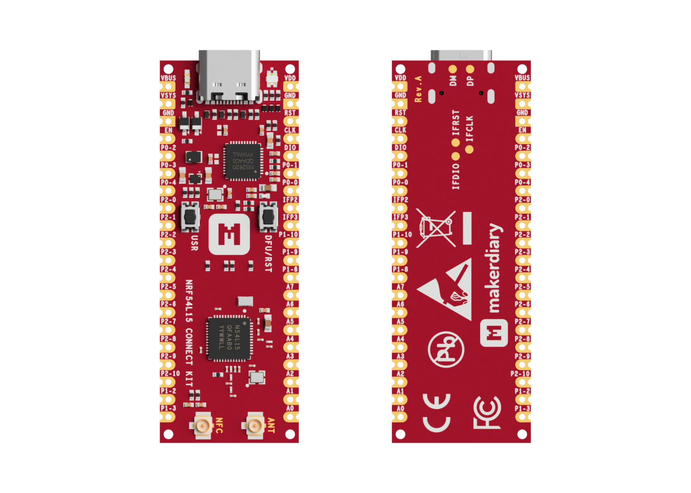
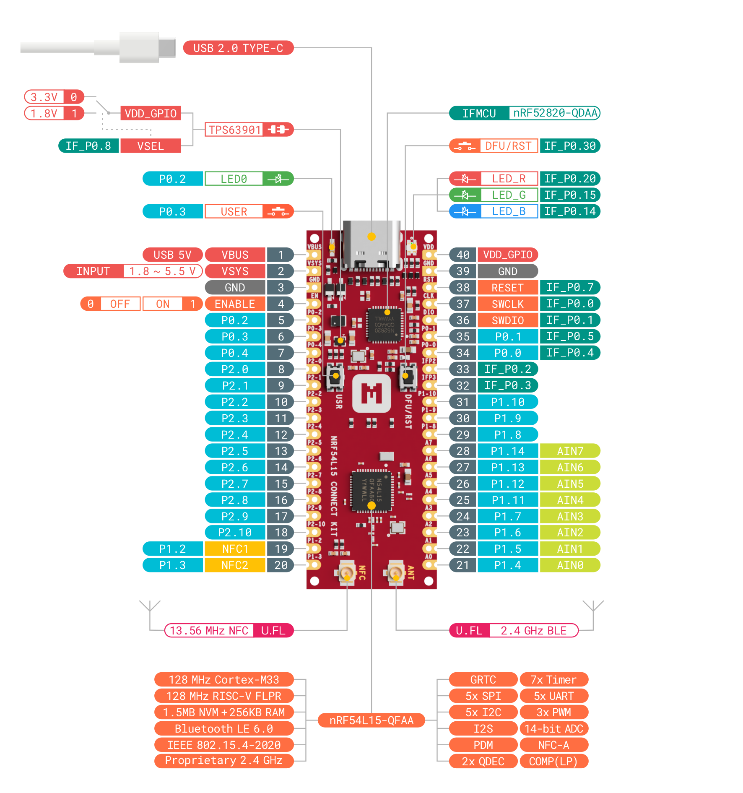
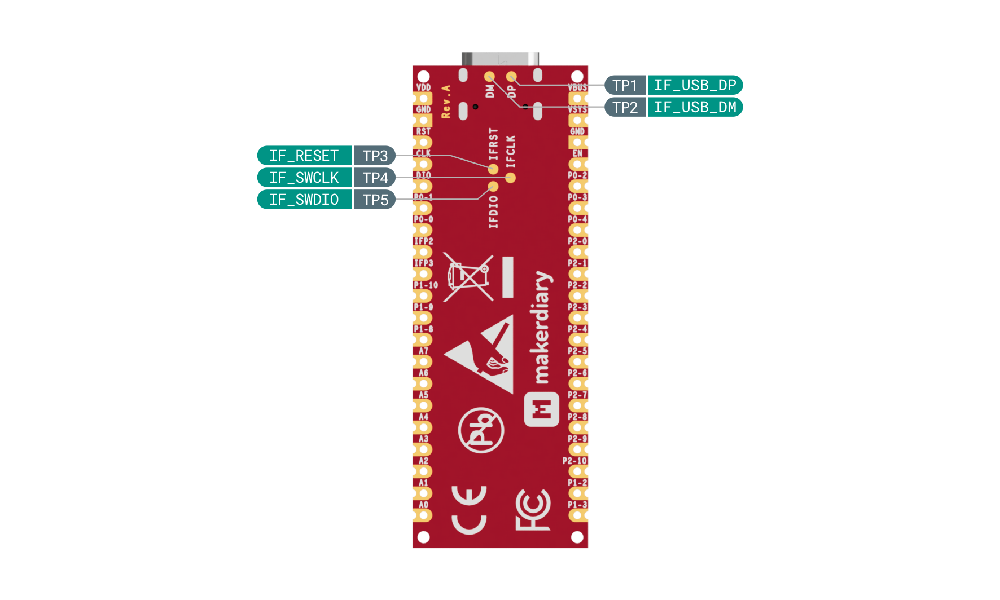
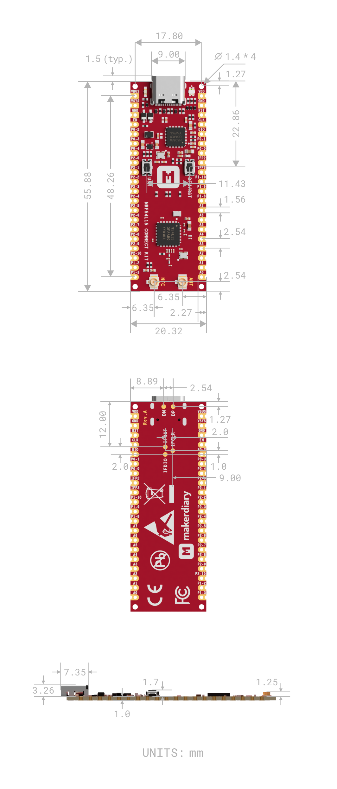

# nRF54L15 Connect Kit

> Rapid Prototyping Kit for Your Next-Gen IoT Devices powered by the nRF54L15 Multiprotocol SoC

[][nrf54l15-connectkit]

## Introduction

[nRF54L15 Connect Kit][nrf54l15-connectkit] is a rapid prototyping kit built around the [nRF54L15][nrf54l15] multiprotocol SoC featuring a 128 MHz Arm Cortex®-M33 processor and a 128 MHz RISC-V coprocessor with 1.5 MB NVM and 256 KB RAM. It supports Bluetooth Low Energy 6.0, Thread®, Matter, Zigbee®, 4 Mbps proprietary 2.4 GHz mode, NFC and enhanced security.

The design integrates an [nRF52820][nrf52820]-based Interface MCU that enables onboard debugging and programming, eliminating the need for external tools. The Interface MCU also includes a USB-UART bridge for log, trace and terminal emulation, and an Interface Shell bundled with helpful commands to access the board-specific functionality.

The board contains a [TPS63901][tps63901] buck-boost converter with 75-nA quiescent current and 1.8V/3.3V configurable power supply for I/Os, supporting various options for easily powering the unit from USB-C, external supplies or batteries.

It also has USB-C, LEDs, Buttons, U.FL receptacles for U.FL cabled 2.4 GHz Antenna and 13.56 MHz NFC Antenna, Arm Serial Wire Debug (SWD) port and dual-row 40 pins with loose or pre-soldered headers available.

[nRF Connect SDK][ncs] is supported, including the [Zephyr RTOS][zephyr]. Developers can explore the full potential of the nRF54L15 using the extensive range of software samples, modules, and libraries available within the nRF Connect SDK. It is open source, and can be leveraged and modified to suit your specific needs.

[][nrf54l15-connectkit]

## Key Features

* Nordic Semiconductor nRF54L15 SoC

	- 128 MHz Arm Cortex®-M33 processor and 128 MHz RISC-V coprocessor
	- 1.5 MB NVM and 256 KB RAM
	- Multiprotocol 2.4 GHz radio supporting Bluetooth Low Energy, 802.15.4-2020, and 2.4 GHz
	  proprietary modes (up to 4 Mbps)
	- Advanced security features with physical protection
	- Global RTC (GRTC) available in System OFF mode
	- 5x SPI/UART/I2C, 3x PWM, 2x QDEC, I2S, PDM, 14-bit ADC, GPIOs
	- Integrated NFC-A Tag

* On-board Interface MCU

	- Built using nRF52820 with 64 MHz Arm Cortex-M4, 256 KB Flash & 32 KB RAM
	- Built-in CMSIS-DAP support for debugging and programming
	- USB-UART bridge for log, trace and terminal emulation
	- Interface Shell with helpful commands to access the board-specific functionality
	- Self-upgradable UF2 Bootloader featuring drag-and-drop programming for Interface MCU firmware update
	- Open source and more features will be released gradually over time

* TPS63901 buck-boost converter with 75-nA quiescent current and 1.8V/3.3V configurable power supply for I/Os
* Shipped with U.FL cabled 2.4 GHz Antenna and 13.56 MHz NFC Antenna
* Up to 31 multi-function GPIOs (8 can be configured as ADC inputs) through edge pins
* Arm Serial Wire Debug (SWD) port through edge pins
* USB-C, LEDs, Buttons and U.FL receptacles
* Dual-row 40 pins in 55.88mm x 20.32mm (2.2" x 0.8") DIP/SMT form factor
* Available in Loose or Pre-soldered headers options
* Built on open source, supporting nRF Connect SDK and Zephyr RTOS, etc

## Hardware Diagram

The following figure illustrates the nRF54L15 Connect Kit hardware diagram. The design is available with loose or pre-soldered pin headers. For more details, refer to the [Hardware description][hw-desc] section.

[][pinout-pdf]

[][pinout-pdf]

## Mechanical Dimensions

The nRF54L15 Connect Kit is a 4-layer chem. Gold, 55.88mm x 20.32mm (2.2" x 0.8") 1mm thick PCB with a USB Type-C port, LEDs, Buttons, U.FL receptacles and 40x castellated/through-hole pins.

[][dxf-files]

## Documentation

We offer a comprehensive set of documentation, including getting started guides, developer guides, and code examples. These resources are designed to reduce development effort and help you achieve faster time-to-market.

* [nRF54L15 Connect Kit Documentation][wiki]
* [nRF54L15 Connect Kit Product Brief][product-brief]
* [nRF54L15 Connect Kit Quick Start Guide][quick-start]
* [Develop with nRF Connect SDK][ncs-guide]
* [nRF54L15 Connect Kit Programming Guide][programming]
* [nRF54L15 Connect Kit Pinout Diagram Rev.A][pinout-pdf]
* [nRF54L15 Connect Kit Hardware Description][hw-desc]
* [nRF54L15 Connect Kit Schematic Rev.A][schematic]
* [nRF54L15 Connect Kit Board DXF Files Rev.A][dxf-files]
* [nRF54L15 Connect Kit 3D Model Rev.A][3d-model]

## Where to Buy

nRF54L15 Connect Kit is available on the following channels (click to go directly to the product):

## Community Support

Community support is provided via [GitHub Discussions][discussions]. We would love to have more developers contribute to this project! If you're passionate about making this project better, see our [Contributing Guidelines][contributing] for more information.

## License

This project is licensed under the Apache License 2.0 unless otherwise stated. For the full license text, please refer to the [LICENSE](./LICENSE) file.

The nRF Connect SDK and its components are licensed under the 5-Clause Nordic License. See [LICENSE-NORDIC](./LICENSE-NORDIC) for further details.

This project may include some imported or reused components that are licensed under different terms. Please refer to the license files within those components for details.

[nrf54l15-connectkit]: https://makerdiary.com/products/nrf54l15-connectkit
[nrf54l15]: https://www.nordicsemi.com/Products/nRF54L15
[nrf52820]: https://www.nordicsemi.com/Products/nRF52820
[tps63901]: https://www.ti.com/product/TPS63901
[ncs]: https://github.com/nrfconnect/sdk-nrf
[zephyr]: https://github.com/zephyrproject-rtos/zephyr
[hw-desc]: https://wiki.makerdiary.com/nrf54l15-connectkit/hardware/
[pinout-pdf]: https://wiki.makerdiary.com/nrf54l15-connectkit/assets/attachments/nrf54l15-connect-kit-pinout-diagram_reva.pdf
[wiki]: https://wiki.makerdiary.com/nrf54l15-connectkit/
[product-brief]: https://wiki.makerdiary.com/nrf54l15-connectkit/introduction/
[quick-start]: https://wiki.makerdiary.com/nrf54l15-connectkit/getting-started/
[ncs-guide]: https://wiki.makerdiary.com/nrf54l15-connectkit/guides/ncs/
[programming]: https://wiki.makerdiary.com/nrf54l15-connectkit/guides/programming/
[schematic]: https://wiki.makerdiary.com/nrf54l15-connectkit/assets/attachments/nrf54l15-connect-kit-schematic_reva.pdf
[dxf-files]: https://wiki.makerdiary.com/nrf54l15-connectkit/assets/attachments/nrf54l15-connect-kit-board-dxf_reva.zip
[3d-model]: https://wiki.makerdiary.com/nrf54l15-connectkit/assets/attachments/nrf54l15-connect-kit-3d-model_reva.step
[discussions]: https://github.com/makerdiary/nrf54l15-connectkit/discussions
[contributing]: https://wiki.makerdiary.com/nrf54l15-connectkit/contributing/
