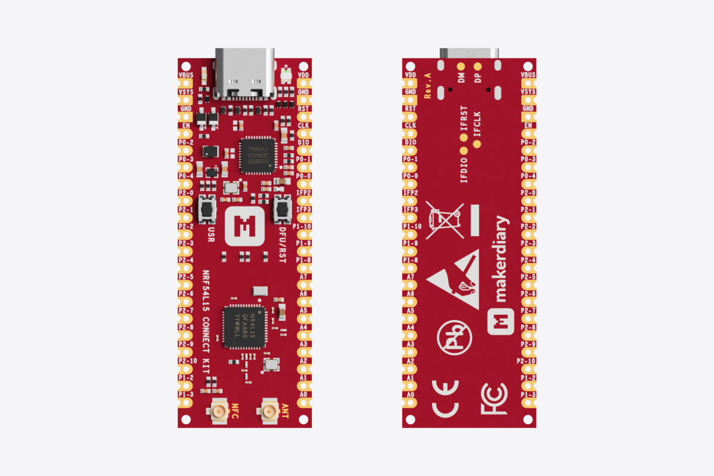

{ loading=lazy }

# nRF54L15 Connect Kit Now Available

## Introduction

Today, we’re thrilled to launch the nRF54L15 Connect Kit, enabling developers to harness
the advanced capabilities of Nordic’s nRF54L15 SoC for cutting-edge IoT designs.

Built on the experience from the successful nRF52 Series—shipped in the billions and trusted
by thousands of developers—the nRF54L Series is set to be a worthy successor. The nRF54L Series
enables the creation of innovative next-generation IoT products. It simplifies design challenges
and ensures reliable wireless communication while raising the bar on achievable battery lifetime.

## Key Features of the nRF54L15 Connect Kit

-    __Powered by nRF54L15 SoC__

     nRF54L15 is a ultra-low-power wireless SoC featuring a 128 MHz Arm Cortex®-M33 processor and a 128 MHz RISC-V coprocessor with 1.5 MB NVM and 256 KB RAM. It supports Bluetooth LE 6.0, Thread®, Matter, Zigbee®, 4 Mbps proprietary 2.4 GHz mode, NFC and enhanced security.

-    __On-board Interface MCU__

     Integrate an nRF52820-based Interface MCU for onboard debugging and programming, eliminating the need for external tools. The Interface MCU also includes a USB-UART bridge for log, trace and terminal emulation, and an Interface Shell to access the board-specific functionality.

-    __Easy-to-use Form Factor__

     Featuring USB-C, LEDs, Buttons, U.FL receptacles for U.FL cabled 2.4 GHz Antenna and 13.56 MHz NFC Antenna, Arm Serial Wire Debug (SWD) port and dual-row 40 pins with loose or pre-soldered headers available.

-    __Flexible Power Management__

     Integrated TPS63901 buck-boost converter with 75-nA quiescent current and 1.8V/3.3V configurable power supply for I/Os, supporting various options for easily powering the unit from USB-C, external supplies or batteries.

-    __Built on Open Source__

     nRF Connect SDK is supported, including the Zephyr RTOS. Developers can explore the full potential of the nRF54L15 using the extensive range of software samples, modules, and libraries available within the nRF Connect SDK.

-    __Well Documented__

     An extensive set of documentation is available, including getting started and developer guides which can help you save big by reducing development effort. The documentation is hosted as a GitHub repository that allows managing the updates over time.

## Getting Started with the nRF54L15 Connect Kit

We think the best way to learn is by doing. Our online documentation takes you through the basics of nRF Connect SDK development and show you how to implement typical use cases with Nordic Semiconductor libraries and drivers on the nRF54L15 Connect Kit.

-   :material-clock-fast:{ .lg .middle } __Quick Start Guide__

    ---

    Navigate you through the process of starting up your new nRF54L15 Connect Kit.

    [:octicons-arrow-right-24: Learn More](../../../getting-started.md)

-   :material-link-box-variant-outline:{ .lg .middle } __Develop with nRF Connect SDK__

    ---

    Set up the nRF Connect SDK development environment, build and run the tested applications and samples.

    [:octicons-arrow-right-24: Learn More](../../../guides/ncs/index.md)

-   :material-console-network-outline:{ .lg .middle } __Programming Guide__

    ---

    Provide comprehensive instructions for programming the nRF54L15 and updating the Interface MCU Firmware.

    [:octicons-arrow-right-24: Learn More](../../../guides/programming/index.md)

__Available now!__ — [Get your nRF54L15 Connect Kit](https://makerdiary.com/products/nrf54l15-connectkit) today and start developing the future of connected devices.
