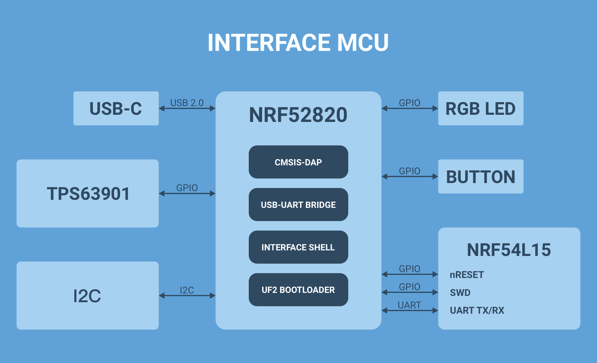

# Interface MCU Firmware

## Overview

This guide walks you through building and running the Interface MCU Firmware which enables a CMSIS-DAP interface for debug and programming, a USB-UART bridge for terminal emulation and an Interface Shell for accessing board-specific functionality.

## How it works

The nRF54L15 Connect Kit comes with an nRF52820-based Interface MCU. The Interface MCU Firmware is running on the nRF52820. It implements a CMSIS-DAP interface for debugging and programming the nRF54L15. It also exposes two USB CDC ACM devices, one acts as a UART bridge between the host and the nRF54L15, the other enables an Interface Shell for accessing board-specific functionality.

The Interface MCU also comes pre-programmed with the UF2 Bootloader, an easy-to-use and self-upgradable bootloader that can be used to update the firmware by just copying the .uf2-format images to the flash drive without using an external programmer.

The following figure describes the functional architecture of the Interface MCU:




## Requirements

Before you start, check that you have the required hardware and software:

- 1x [nRF54L15 Connect Kit](https://makerdiary.com/products/nrf54l15-connectkit)
- 1x USB-C Cable
- A computer running macOS, Ubuntu, or Windows 10 or newer

## Building the application

To build the application, follow the instructions in [Getting Started Guide] to set up your preferred building environment.

Use the following steps to build the [Interface MCU Firmware] on the command line.

1. Open a terminal window.

2. Go to `NCS-Project/nrf54l15-connectkit` repository cloned in the [Getting Started Guide].

3. Build the application using the `west build` command, specifying the board (following the `-b` option) as `nrf54l15_connectkit/nrf52820`.

	``` bash
	west build -p always -b nrf54l15_connectkit/nrf52820 applications/ifmcu_firmware
	```

	!!! Tip
		The `-p` always option forces a pristine build, and is recommended for new users. Users may also use the `-p auto` option, which will use heuristics to determine if a pristine build is required, such as when building another application.

4. After building the application successfully, the firmware with the name `zephyr.uf2` can be found in the `build/ifmcu_firmware/zephyr` directory.

## Flashing the firmware

The application is compatible with the UF2 Bootloader, so that you can easily flash the firmware by just copying the `zephyr.uf2` file to the flash drive without using an external programmer. 

To flash the firmware, complete the following steps:

1. Push and hold the __DFU/RST__ button and connect your board to the USB port of your computer. Release the __DFU/RST__ button after your board is connected.

2. It will mount as a Mass Storage Device called __UF2BOOT__. The RGB LED is breathing in green.

3. Drag and drop `zephyr.uf2` onto the __UF2BOOT__ volume. The RGB LED blinks green rapidly during programming.

4. The application starts running after the firmware programming is completed.

!!! Note
	You may experience the following errors when copying the firmware to the __UF2BOOT__ drive on __macOS 14.5 or newer__:

	<div class="grid" markdown>

	

	``` { .bash .no-copy linenums="1" title="Terminal" }
	$ cp build/ifmcu_firmware/zephyr/zephyr.uf2 /Volumes/UF2BOOT
	cp: /Volumes/UF2BOOT/zephyr.uf2: fcopyfile failed: Input/output error
	cp: /Volumes/UF2BOOT/zephyr.uf2: fchmod failed: No such file or directory
	```

	</div>

	Currently you can ignore these errors as the firmware programming is completed and the application should work as expected.

## Usage

### Using the CMSIS-DAP Interface

You can use the CMSIS-DAP Interface to debug or program the nRF54L15.

Before you start, a tool that supports the CMSIS-DAP protocol should be installed. [pyOCD v0.38.0] or newer is required. pyOCD will be installed after setting up your development environment in [Getting Started Guide].

!!! Note
	On Linux, permission to access USB devices from user space must be explicitly granted via udev rules. See [udev rules on Linux] for detailed instructions. 

The following sections show the typical use cases with pyOCD:

- To show the connected devices, use `pyocd list`:

	``` { .bash .no-copy linenums="1" title="Terminal" }
	#   Probe/Board              Unique ID               Target
	-----------------------------------------------------------------
	0   ZEPHYR IFMCU CMSIS-DAP   820D9A5F0E322B8EFE662   ✔︎ nrf54l
		Makerdiary               nRF54L15 Connect Kit
	```

- To program the nRF54L15 application firmware, use `pyocd load`:

    ``` bash
    pyocd load -t nrf54l <firmware.hex> # (1)!
    ```

    1.  You can also use `pyocd flash` instead:
        ``` bash
        pyocd flash -t nrf54l <firmware.hex>
        ```

- To erase the entire non-volatile memory (RRAM) of the nRF54L15, run the following command:

	``` bash
	pyocd erase -t nrf54l --chip
	```

To learn more about pyOCD, see the [pyOCD Documentation].

### Using the USB-UART Bridge

The primary USB CDC ACM device that the Interface MCU exposes acts as a UART bridge between the host and the nRF54L15. 

To see the UART output, connect to the board with a terminal emulator, specifying the correct serial port that your computer uses to communicate with the nRF54L15:

=== "Windows"

	1. Start [PuTTY].
	2. Configure the correct serial port and click __Open__:

		

=== "macOS"

	Open up a terminal and run:

	``` bash
	screen <serial-port-name> 115200
	```

=== "Ubuntu"

	Open up a terminal and run:

	``` bash
	screen <serial-port-name> 115200
	```

!!! Tip
	The default serial port settings are the following:

	| Baud rate | Data bits | Stop bits | Parity | Flow Control |
	| ----------|-----------|-----------|--------|--------------|
	| 115200    | 8         | 1         | None   | None         |

### Using the Interface Shell

The secondary USB CDC ACM device that the Interface MCU exposes enables an Interface Shell for accessing the board-specific functionality.

To interact with the Interface Shell, connect to the board with a terminal emulator, specifying the correct serial port that your computer uses to communicate with the shell:

=== "Windows"

	1. Start [PuTTY].
	2. Configure the correct serial port and click __Open__:

		

=== "macOS"

	Open up a terminal and run:

	``` bash
	screen <serial-port-name> 115200
	```

=== "Ubuntu"

	Open up a terminal and run:

	``` bash
	screen <serial-port-name> 115200
	```

!!! Tip
	The default serial port settings are the following:

	| Baud rate | Data bits | Stop bits | Parity | Flow Control |
	| ----------|-----------|-----------|--------|--------------|
	| 115200    | 8         | 1         | None   | None         |


Type ++tab++ to list all supported commands. When you type a command with `--help`, the terminal shows its usage, for example `i2c --help`. For more information about the commands, see the [Interface Shell Command Reference](#interface-shell-command-reference).

``` { .txt .no-copy linenums="1" title="Terminal" }
ifsh:~$
  bootloader  cfgsync     clear       device      gpio        help
  history     i2c         kernel      rem         reset       resize
  retval      settings    shell       temp        version     viosel
ifsh:~$ i2c --help
i2c - I2C commands
Subcommands:
  scan  : Scan I2C devices
                 Usage: scan <device>
  recover  : Recover I2C bus
                 Usage: recover <device>
  read  : Read bytes from an I2C device
                 Usage: read <device> <addr> <reg> [<bytes>]
  read_byte  : Read a byte from an I2C device
                 Usage: read_byte <device> <addr> <reg>
  direct_read  : Read byte stream directly from an I2C device without writing a
                 register address first
                 Usage: direct_read <device> <addr> [<bytes>]
  write  : Write bytes to an I2C device
                 Usage: write <device> <addr> <reg> [<byte1>, ...]
  write_byte  : Write a byte to an I2C device
                 Usage: write_byte <device> <addr> <reg> <value>
  speed  : Configure I2C bus speed
                 Usage: speed <device> <speed>
ifsh:~$
```

## Interface Shell Command Reference

The following table describes all supported commands of the Interface Shell:

| Command | Description |
|---------|-------------|
| __`bootloader`__ | Enter Interface MCU UF2 Bootloader. |
| __`cfgsync`__    | Store settings to the non-volatile memory. Only `viosel` commands can affect the settings. |
| __`clear`__ | Clear shell screen. |
| __`device list`__ | List all configured devices in the devicetree. |
| __`gpio conf <device> <pin> <configuration <i|o>[u|d][h|l][0|1]> [vendor specific]`__ | Configure GPIO pin. |
| __`gpio get <device> <pin>`__ | Get GPIO pin value. |
| __`gpio set <device> <pin> <level 0|1>`__ | Set GPIO pin value. |
| __`gpio toggle <device> <pin>`__ | Toggle GPIO pin. |
| __`gpio devices`__ | List all GPIO devices. |
| __`gpio blink <device> <pin>`__ | Blink GPIO pin. |
| __`gpio info [device]`__ | GPIO Information. |
| __`help`__ | Show help information. |
| __`history`__ | Show command history. |
| __`i2c scan <device>`__ | Scan I2C devices. <br/> Use `device list` to get the I2C bus name `<device>`. |
| __`i2c recover <device>`__ | Recovery I2C bus. <br/> Use `device list` to get the I2C bus name `<device>`. |
| __`i2c read <device> <addr> <reg> [<bytes>]`__ | Read bytes from an I2C device. <br/> Use `device list` to get the I2C bus name `<device>`. |
| __`i2c read_byte <device> <addr> <reg>`__ | Read a byte from an I2C device. <br/> Use `device list` to get the I2C bus name `<device>`. |
| __`i2c direct_read <device> <addr> [<bytes>]`__ | Read byte stream directly from an I2C device without writing a register address first. <br/> Use `device list` to get the I2C bus name `<device>`. |
| __`i2c write <device> <addr> <reg> [<byte1>, ...]`__ | Write bytes to an I2C device. <br/> Use `device list` to get the I2C bus name `<device>`. |
| __`i2c write_byte <device> <addr> <reg> <value>`__ | Write a byte to an I2C device. <br/> Use `device list` to get the I2C bus name `<device>`. |
| __`i2c speed <device> <speed>`__ | Configure I2C bus speed. <br/> Use `device list` to get the I2C bus name `<device>`. |
| __`kernel cycles`__ | Get Kernel cycles. |
| __`kernel reboot`__ | Reboot kernel. |
| __`kernel sleep <ms>`__ | Kernel sleeps for <ms> millisecond. |
| __`kernel thread list`__ | List kernel threads. |
| __`kernel thread stacks`__ | List threads stack usage. |
| __`rem`__ | Ignore lines beginning with 'rem '. |
| __`reset [nrf54l15]`__ | Reset nRF54L15. |
| __`reset nrf52820`__ | Reset nRF52820. |
| __`resize`__ | Console gets terminal screen size or assumes `default` in case the readout fails. It must be executed after each terminal width change to ensure correct text display. |
| __`resize default`__ | Assume 80 chars screen width and send this setting to the terminal. |
| __`retval`__ | Print return value of most recent command. |
| __`settings list [subtree]`__ | List all settings in a subtree (omit to list all). |
| __`settings read [type] <name>`__ | Read a specific setting. <br/> `type`: `string` or `hex` (default: `hex`) |
| __`settings write [type] <name> <value>`__ | Write to a specific setting. <br/> `type`: `string` or `hex` (default: `hex`) |
| __`settings delete <name>`__ | Delete a specific setting. |
| __`shell backends`__ | List active shell backends. |
| __`shell backspace_mode`__ | Toggle backspace key mode. Some terminals are not sending separate escape code for backspace and delete key. This command forces shell to interpret delete key as backspace. |
| __`shell colors`__ | Toggle colored syntax. |
| __`shell vt100`__ | Toggle vt100 commands. |
| __`shell prompt`__ | Toggle prompt. |
| __`shell echo`__ | Toggle shell echo. |
| __`shell stats reset`__ | Reset shell statistics for the Logger module. |
| __`shell stats show`__ | Get shell statistics for the Logger module. |
| __`temp`__ | Get the die temperature of the nRF52820. |
| __`version [-a|--all]`__ | Show Interface MCU version. <br/> Use `-a` or `--all` option to show more details.|
| __`viosel [0|1]`__ | Get or set VIO voltage <br/> `0` (default): 3.3V <br/> `1`: 1.8V |


[Getting Started Guide]: ../getting-started.md
[Interface MCU Firmware]: https://github.com/makerdiary/nrf54l15-connectkit/tree/main/applications/ifmcu_firmware
[PuTTY]: https://apps.microsoft.com/store/detail/putty/XPFNZKSKLBP7RJ
[pyOCD Documentation]: https://pyocd.io/docs/
[pyOCD v0.38.0]: https://github.com/pyocd/pyOCD/releases/tag/v0.38.0
[udev rules on Linux]: ../../../troubleshooting.md#udev-rules-on-linux
