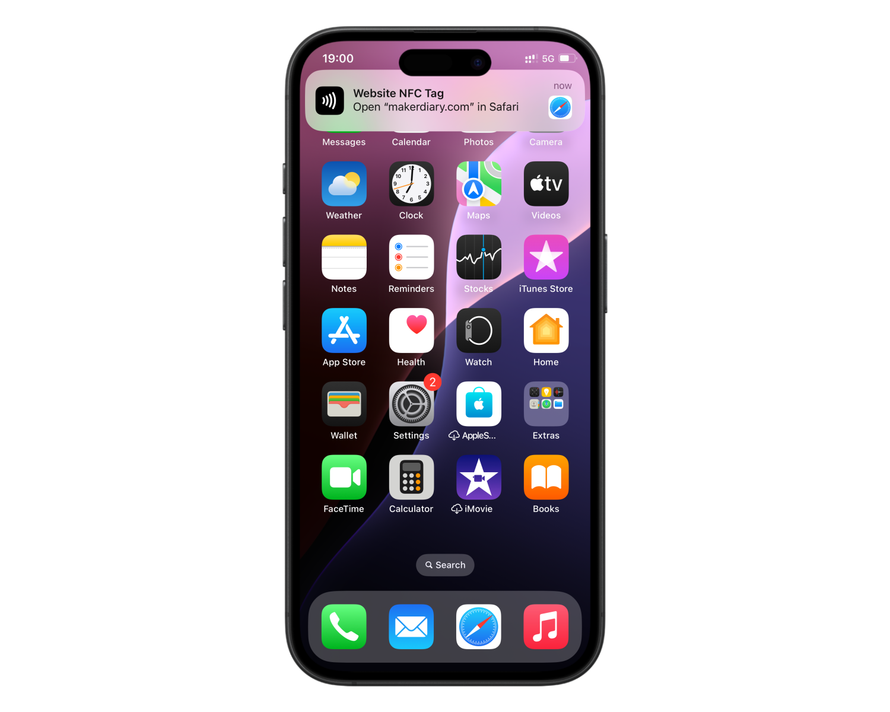

# Quick Start Demo

## Overview

The Quick Start Demo application enables you to test various features of the nRF54L15 Connect Kit such as Zephyr Shell, LED, Button, NFC tag, and Bluetooth Low Energy connectivity.

!!! Tip
	The nRF54L15 Connect Kit comes pre-programmed with the [Quick Start Demo] application, enabling you to explore its various features right out of the box.

## Requirements

Before you start, check that you have the required hardware and software:

- 1x [nRF54L15 Connect Kit](https://makerdiary.com/products/nrf54l15-connectkit)
- 1x U.FL cabled 2.4 GHz Antenna (included in the box)
- 1x U.FL cabled 13.56 MHz NFC Antenna (included in the box)
- 1x USB-C Cable
- A smartphone or a tablet with NFC support
- A computer running macOS, Ubuntu, or Windows 10 or newer

## Installing nRF Blinky App

[nRF Blinky] is a simple mobile app for developers new to Bluetooth Low Energy. It can:

:material-checkbox-marked: Scan and connect to a peripheral device advertising with the proprietary/vendor-specific LED Button Service (LBS) UUID

:material-checkbox-marked: Write to the LED Characteristic to change the state of an LED

:material-checkbox-marked: Be notified when the Button Characteristic changes state because of a button press

[{ width='128' display='inline' }](https://apps.apple.com/us/app/nrf-blinky/id1325014347)
[{ width='148' display='inline' }](https://play.google.com/store/apps/details?id=no.nordicsemi.android.nrfblinky&hl=en&gl=US)

## Setting up your board

:material-numeric-1-circle: Attach the U.FL cabled 2.4 GHz Antenna.

:material-numeric-2-circle: Attach the U.FL cabled 13.56 MHz NFC Antenna.

:material-numeric-3-circle: Connect the nRF54L15 Connect Kit to the computer with a USB-C cable.


## Building the application

To build the application, follow the instructions in [Getting Started Guide] to set up your preferred building environment.

Use the following steps to build the [Quick Start Demo] application on the command line.

1. Open a terminal window.

2. Go to `NCS-Project/nrf54l15-connectkit` repository cloned in the [Getting Started Guide].

3. Build the application using the `west build` command, specifying the board (following the `-b` option) as `nrf54l15_connectkit/nrf54l15/cpuapp`.

	``` bash
	west build -p always -b nrf54l15_connectkit/nrf54l15/cpuapp applications/quick_start_demo
	```

	!!! Tip
		The `-p` always option forces a pristine build, and is recommended for new users. Users may also use the `-p auto` option, which will use heuristics to determine if a pristine build is required, such as when building another application.

4. After building the application successfully, the firmware with the name `merged.hex` can be found in the `build` directory.

## Flashing the firmware

Flash the application firmware using `west flash`:

``` bash
west flash
```

!!! Tip
	In case you wonder, the `west flash` will execute the following command:

	``` bash
	pyocd load --target nrf54l --frequency 4000000 build/merged.hex
	```

## Testing

After programming the application, test it by performing the following steps:

### Connecting to Zephyr Shell

Once the board is connected, it exposes two COM ports, the primary COM port is connected to the Zephyr Shell whose terminal prompt appears as **`uart:~$`**.

Open up a serial terminal, specifying the Zephyr Shell COM port:

=== "Windows"

	1. Start [PuTTY].
	2. Configure the correct serial port and click __Open__:

		

=== "macOS"

	Open up a terminal and run:

	``` bash
	screen <serial-port-name> 115200
	```

=== "Ubuntu"

	Open up a terminal and run:

	``` bash
	screen <serial-port-name> 115200
	```

Press the **DFU/RST** button to reset the nRF54L15. Observe the output of the terminal. You should see the output, similar to what is shown in the following:

```{ .txt .no-copy linenums="1" title="Terminal" }
*** Booting Quick Start Demo v3.0.99-1a6c72f84a4f ***
*** Using nRF Connect SDK v3.1.0-preview2-3674486b55f7 ***
*** Using Zephyr OS v4.1.99-701bd803eafa ***
[00:59:05.574,367] <inf> main: NFC configuration done
[00:59:05.574,969] <inf> fs_zms: 2 Sectors of 4096 bytes
[00:59:05.574,978] <inf> fs_zms: alloc wra: 0, ef0
[00:59:05.574,985] <inf> fs_zms: data wra: 0, 90
[00:59:05.575,206] <inf> bt_sdc_hci_driver: SoftDevice Controller build revision:
											45 cf f0 60 96 1a 6b 63  10 19 b6 85 40 c5 83 b2 |E..`..kc ....@...
											18 e5 4f bc                                      |..O.
[00:59:05.576,506] <inf> bt_hci_core: HW Platform: Nordic Semiconductor (0x0002)
[00:59:05.576,521] <inf> bt_hci_core: HW Variant: nRF54Lx (0x0005)
[00:59:05.576,536] <inf> bt_hci_core: Firmware: Standard Bluetooth controller (0x00) Version 69.61647 Build 1796904544
[00:59:05.576,668] <inf> bt_hci_core: No ID address. App must call settings_load()
[00:59:05.576,675] <inf> main: Bluetooth initialized
[00:59:05.577,012] <inf> bt_hci_core: Identity: F4:3D:C2:1E:6E:74 (random)
[00:59:05.577,030] <inf> bt_hci_core: HCI: version 6.0 (0x0e) revision 0x311b, manufacturer 0x0059
[00:59:05.577,046] <inf> bt_hci_core: LMP: version 6.0 (0x0e) subver 0x311b
[00:59:05.578,386] <inf> main: Advertising successfully started
uart:~$
```

Type ++tab++ to list all supported commands. When you type a command with `--help`, the terminal shows its usage, for example `gpio --help`:

```{ .txt .no-copy linenums="21" title="Terminal" }
uart:~$
  adc      bt       clear    date     device   devmem   gatt     gpio
  help     history  kernel   log      rem      resize   retval   shell
  stats
uart:~$ gpio --help
gpio - GPIO commands
Subcommands:
  conf     : Configure GPIO pin
			 Usage: gpio conf <device> <pin> <configuration
			 <i|o>[u|d][h|l][0|1]> [vendor specific]
			 <i|o> - input|output
			 [u|d] - pull up|pull down, otherwise open
			 [h|l] - active high|active low, otherwise defaults to active high
			 [0|1] - initialise to logic 0|logic 1, otherwise defaults to logic
			 0
			 [vendor specific] - configuration flags within the mask 0xFF00
			 see include/zephyr/dt-bindings/gpio/
  get      : Get GPIO pin value
			 Usage: gpio get <device> <pin>
  set      : Set GPIO pin value
			 Usage: gpio set <device> <pin> <level 0|1>
  toggle   : Toggle GPIO pin
			 Usage: gpio toggle <device> <pin>
  devices  : List all GPIO devices
			 Usage: gpio devices
  blink    : Blink GPIO pin
			 Usage: gpio blink <device> <pin>
  info     : GPIO Information
			 Usage: gpio info [device]
```

### LED Blinking Test

Now you can blink the **Green LED** using GPIO commands in the Zephyr Shell.

1. To control the __Green LED__, configure the GPIO pin __P0.2__ as an output:

	``` bash
	gpio conf gpio0 2 o
	```

2. Blink the __Green LED__ using the `gpio blink` command:

	``` bash
	gpio blink gpio0 2
	```

3. The __Green LED__ starts to blink. Observe the output of the terminal. You should see the output, similar to what is shown in the following:

	``` { .txt .no-copy linenums="50" title="Terminal" }
	uart:~$ gpio conf gpio0 2 o
	uart:~$ gpio blink gpio0 2
	Hit any key to exit
	```

4. Hit any key in the Shell to stop the LED blinking.

### Button Input Test

When the application starts, it prints any input event using the Input APIs. Press the __USR__ button and observe the output of the terminal. You should see the output, similar to what is shown in the following:

``` { .txt .no-copy linenums="53" title="Terminal" }
[00:20:46.758,664] <inf> input: input event: dev=buttons SYN type= 1 code= 11 value=1
[00:20:47.441,742] <inf> input: input event: dev=buttons SYN type= 1 code= 11 value=0
[00:36:18.853,192] <inf> input: input event: dev=buttons SYN type= 1 code= 11 value=1
[00:36:19.004,974] <inf> input: input event: dev=buttons SYN type= 1 code= 11 value=0
uart:~$ 
```

### NFC Tag Test

When the application starts, it initializes the NFC tag and generates a URI message with a URI record containing the URL "https://makerdiary.com". Test it by performing the following steps:

1. Touch the NFC antenna with the smartphone or tablet.

2. Observe that the smartphone or tablet tries to open the URL "https://makerdiary.com" in a web browser.



### BLE Connectivity Test

The application exposes a Nordic LED Button Service (LBS). It sends the state of __USR__ button on the board to the connected device, such as a phone or tablet. The [nRF Blinky] app can display the received button state and control the state of __Green LED__ on the board. Test it by performing the following steps:

1. Open the [nRF Blinky] app, observe that the board is advertising with the Device Name __Nordic_LBS__.

	

2. Tap __Nordic_LBS__ to establish a connection with the board, then:

	- Toggle the LED switch in the app to turn the __Green LED__ ON/OFF
	- Press the __USR__ button on the board, and the app will show its state (Pressed/Released)

	

[Quick Start Demo]: https://github.com/makerdiary/nrf54l15-connectkit/tree/main/applications/quick_start_demo
[nRF Blinky]: https://www.nordicsemi.com/Products/Development-tools/nRF-Blinky
[Getting Started Guide]: ../getting-started.md
[PuTTY]: https://apps.microsoft.com/store/detail/putty/XPFNZKSKLBP7RJ
