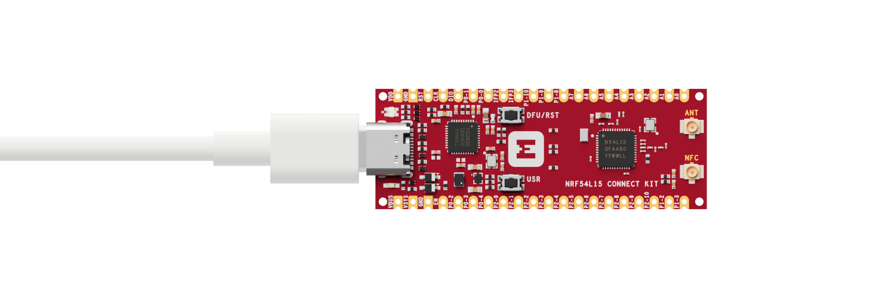
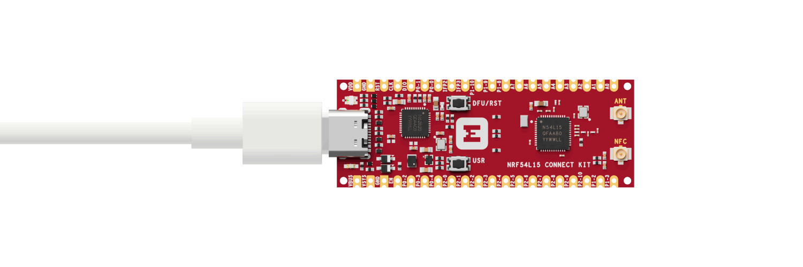

# Getting Started Guide

This guide walks you through setting up the nRF Connect SDK development environment, building and running the [Blinky] sample on the nRF54L5 Connect Kit.

The nRF Connect SDK is based on the Zephyr Project, which means everything required by [Zephyr’s Getting Started Guide] is also suitable for the nRF Connect SDK.

## Select and Update OS

Install available updates for your operating system:

=== "Windows"

	Select __Start__ > __Settings__ > __Update & Security__ > __Windows Update__. Click __Check for updates__ and install any that are available.

=== "macOS"

	On macOS Mojave or later, select __System Preferences...__ > __Software Update__. Click __Update Now__ if necessary.

	On other versions, see [this Apple support topic](https://support.apple.com/en-us/HT201541).

=== "Ubuntu"

	This guide covers Ubuntu version 20.04 LTS and later.

	``` bash linenums="1"
	sudo apt update
	```

	``` bash linenums="2"
	sudo apt upgrade
	```

## Install dependencies

Next, you’ll install some host dependencies using your package manager.

The current minimum required version for the main dependencies are:

| Tool                  | Min. Version |
|-----------------------|--------------|
| [CMake]               | 3.20.5       |
| [Python]              | 3.10         |
| [Devicetree compiler] | 1.4.6        |

=== "Windows"

	In modern version of Windows (10 and later) it is recommended to install the Windows Terminal application from the Microsoft Store. Instructions are provided for a `cmd.exe` or PowerShell command prompts.

	These instructions rely on Windows' official package manager, [winget]. If using winget isn’t an option, you can install dependencies from their respective websites and ensure the command line tools are on your __`PATH`__ environment variable.

	1. In modern Windows versions, `winget` is already pre-installed by default. You can verify that this is the case by typing `winget` in a terminal window. If that fails, you can then [install winget].

	2. Open a Command Prompt (`cmd.exe`) or PowerShell terminal window. To do so, press the Windows key ++win++ , type `cmd.exe` or PowerShell and click on the result.

	3. Use `winget` to install the required dependencies:

		``` cmd
		winget install Kitware.CMake Ninja-build.Ninja oss-winget.gperf python Git.Git oss-winget.dtc wget 7zip.7zip
		```
	
	4. Close the terminal window.

	!!! Note
		You may need to add the 7zip installation folder to your __`PATH`__.

=== "macOS"

	1. Install [Homebrew]:

		``` bash
		/bin/bash -c "$(curl -fsSL https://raw.githubusercontent.com/Homebrew/install/HEAD/install.sh)"
		```

	2. After the Homebrew installation script completes, follow the on-screen instructions to add the Homebrew installation to the path.

		=== "Apple Silicon"

			``` bash linenums="1"
			(echo; echo 'eval "$(/opt/homebrew/bin/brew shellenv)"') >> ~/.zprofile
			```

			``` bash linenums="2"
			source ~/.zprofile
			```

		=== "Intel"

			``` bash linenums="1"
			(echo; echo 'eval "$(/usr/local/bin/brew shellenv)"') >> ~/.zprofile
			```

			``` bash linenums="2"
			source ~/.zprofile
			```

	3. Use `brew` to install the required dependencies:

		``` bash
		brew install cmake ninja gperf python3 python-tk ccache qemu dtc libmagic wget openocd
		```
	
	4. Add the Homebrew Python folder to the path, in order to be able to execute `python` and `pip` as well `python3` and `pip3`.

		``` bash linenums="1"
		(echo; echo 'export PATH="'$(brew --prefix)'/opt/python/libexec/bin:$PATH"') >> ~/.zprofile
		```

		``` bash linenums="2"
		source ~/.zprofile
		```

	!!! Tip
		To check the versions of these dependencies installed, run the following command:

		``` bash
		brew list --versions
		```

=== "Ubuntu"

	1. If using an Ubuntu version older than 22.04, it is necessary to add extra repositories to meet the minimum required versions for the main dependencies listed above. In that case, download, inspect and execute the Kitware archive script to add the Kitware APT repository to your sources list. A detailed explanation of `kitware-archive.sh` can be found here [kitware third-party apt repository]:

		``` bash linenums="1"
		wget https://apt.kitware.com/kitware-archive.sh
		```

		``` bash linenums="2"
		sudo bash kitware-archive.sh
		```
    
	2. Use `apt` to install the required dependencies:

		``` bash linenums="1"
		sudo apt install --no-install-recommends git cmake ninja-build gperf \
		ccache dfu-util device-tree-compiler wget \
		python3-dev python3-pip python3-setuptools python3-tk python3-wheel xz-utils file \
		make gcc gcc-multilib g++-multilib libsdl2-dev libmagic1
		```

		!!! Note
			Due to the unavailability of `gcc-multilib` and `g++-multilib` on AArch64 (ARM64) systems, you may need to remove them from the list of packages to install.

	3. Verify the versions of the main dependencies installed on your system by entering:

		``` bash linenums="1"
		cmake --version
		```

		``` bash linenums="2"
		python3 --version
		```

		``` bash linenums="3"
		dtc --version
		```

## Get the code and install Python dependencies

To help you quickly build and run the samples on the nRF54L15 Connect Kit, the primary [nrf54l15-connectkit] repository contains the nRF Connect SDK manifest repositories, additional hardware drivers and tested samples, etc.

In the following instructions the name `NCS-Project` is used for the workspace, however in practice its name and location can be freely chosen. You’ll also install additional Python dependencies in a [Python virtual environment].

=== "Windows"

	1. Open a `cmd.exe` or PowerShell terminal window __as a regular user__

	2. Create a new virtual environment:

		=== "Batchfile"

			``` bat linenums="1"
			cd %HOMEPATH%
			```

			``` bat linenums="2"
			python -m venv NCS-Project\.venv
			```

		=== "PowerShell"

			``` bat linenums="1"
			cd $Env:HOMEPATH
			```

			``` bat linenums="2"
			python -m venv NCS-Project\.venv
			```

	3. Activate the virtual environment:

		=== "Batchfile"

			``` bat
			NCS-Project\.venv\Scripts\activate.bat
			```

		=== "PowerShell"

			``` bat
			NCS-Project\.venv\Scripts\Activate.ps1
			```

		Once activated your shell will be prefixed with `(.venv)`. The virtual environment can be deactivated at any time by running `deactivate`.

		!!! Note
			Remember to activate the virtual environment every time you start working.

	4. Install `west`:

		``` bat
		pip install west
		```

	5. Get the latest source code:

		``` bat
		west init -m https://github.com/makerdiary/nrf54l15-connectkit --mr main NCS-Project
		```

		!!! Tip
			You can initialize `west` with the revision of the project that you want to check out. For example, to check out the `v1.0.0` release, use the following command instead:

			``` bat
			west init -m https://github.com/makerdiary/nrf54l15-connectkit --mr v1.0.0 NCS-Project
			```

	6. Enter the following commands to clone the project repositories:

		``` bat linenums="1"
		cd NCS-Project
		```

		``` bat linenums="2"
		west update
		```

		After all the repositories updated, your workspace folder now looks similar to this:

		``` { .bat .no-copy linenums="1" }
		NCS-Project
		|___ .venv
		|___ .west
		|___ bootloader
		|___ modules
		|___ nrf
		|___ nrf54l15-connectkit
		|___ nrfxlib
		|___ test
		|___ tools
		|___ zephyr
		|___ ...

		``` 

	7. Export a [Zephyr CMake package]. This allows CMake to automatically load boilerplate code required for building Zephyr applications.

		``` bat
		west zephyr-export
		```

	8. The Zephyr west extension command `west packages` can be used to install Python dependencies.

		``` bat
		west packages pip --install
		```

	9. To flash and debug the nRF54L15, the latest pyOCD package from the HEAD of the `develop` branch is required:

		``` bat
		pip install git+https://github.com/pyocd/pyOCD.git@develop --upgrade
		```

=== "macOS"

	1. Create a new virtual environment:

		``` bash
		python3 -m venv ~/NCS-Project/.venv
		```

	2. Activate the virtual environment:

		``` bash
		source ~/NCS-Project/.venv/bin/activate
		```

		Once activated your shell will be prefixed with `(.venv)`. The virtual environment can be deactivated at any time by running `deactivate`.

		!!! Note
			Remember to activate the virtual environment every time you start working.

	3. Install `west`:

		``` bash
		pip install west
		```

	4. Get the latest source code:

		``` bash
		west init -m https://github.com/makerdiary/nrf54l15-connectkit --mr main NCS-Project
		```

		!!! Tip
			You can initialize `west` with the revision of the project that you want to check out. For example, to check out the `v1.0.0` release, use the following command instead:

			``` bash
			west init -m https://github.com/makerdiary/nrf54l15-connectkit --mr v1.0.0 NCS-Project
			```

	5. Enter the following commands to clone the project repositories:

		``` bash linenums="1"
		cd NCS-Project
		```

		``` bash linenums="2"
		west update
		```

		After all the repositories updated, your workspace folder now looks similar to this:

		``` { .bat .no-copy linenums="1" }
		NCS-Project
		|___ .venv
		|___ .west
		|___ bootloader
		|___ modules
		|___ nrf
		|___ nrf54l15-connectkit
		|___ nrfxlib
		|___ test
		|___ tools
		|___ zephyr
		|___ ...

		``` 

	6. Export a [Zephyr CMake package]. This allows CMake to automatically load boilerplate code required for building Zephyr applications.

		``` bash
		west zephyr-export
		```

	7. The Zephyr west extension command `west packages` can be used to install Python dependencies.

		``` bash
		west packages pip --install
		```

	8. To flash and debug the nRF54L15, the latest pyOCD package from the HEAD of the `develop` branch is required:

		``` bash
		pip install git+https://github.com/pyocd/pyOCD.git@develop --upgrade
		```

=== "Ubuntu"

	1. Use `apt` to install Python `venv` package:

		``` bash
		sudo apt install python3-venv
		```

	2. Create a new virtual environment:

		``` bash
		python3 -m venv ~/NCS-Project/.venv
		```

	3. Activate the virtual environment:

		``` bash
		source ~/NCS-Project/.venv/bin/activate
		```

		Once activated your shell will be prefixed with `(.venv)`. The virtual environment can be deactivated at any time by running `deactivate`.

		!!! Note
			Remember to activate the virtual environment every time you start working.

	4. Install `west`:

		``` bash
		pip install west
		```

	5. Get the latest source code:

		``` bash
		west init -m https://github.com/makerdiary/nrf54l15-connectkit --mr main NCS-Project
		```

		!!! Tip
			You can initialize `west` with the revision of the project that you want to check out. For example, to check out the `v1.0.0` release, use the following command instead:

			``` bash
			west init -m https://github.com/makerdiary/nrf54l15-connectkit --mr v1.0.0 NCS-Project
			```

	6. Enter the following commands to clone the project repositories:

		``` bash linenums="1"
		cd NCS-Project
		```

		``` bash linenums="2"
		west update
		```

		After all the repositories updated, your workspace folder now looks similar to this:

		``` { .bat .no-copy linenums="1" }
		NCS-Project
		|___ .venv
		|___ .west
		|___ bootloader
		|___ modules
		|___ nrf
		|___ nrf54l15-connectkit
		|___ nrfxlib
		|___ test
		|___ tools
		|___ zephyr
		|___ ...

		``` 

	7. Export a [Zephyr CMake package]. This allows CMake to automatically load boilerplate code required for building Zephyr applications.

		``` bash
		west zephyr-export
		```

	8. The Zephyr west extension command `west packages` can be used to install Python dependencies.

		``` bash
		west packages pip --install
		```

	9. To flash and debug the nRF54L15, the latest pyOCD package from the HEAD of the `develop` branch is required:

		``` bat
		pip install git+https://github.com/pyocd/pyOCD.git@develop --upgrade
		```

		!!! Note
			On Linux, permission to access USB devices from user space must be explicitly granted via udev rules. See [udev rules on Linux] for detailed instructions. 

## Install the Zephyr SDK

The [Zephyr Software Development Kit (SDK)] contains toolchains for each of Zephyr’s supported architectures, which include a compiler, assembler, linker and other programs required to build Zephyr applications.

For Linux, it also contains additional host tools, such as custom QEMU and OpenOCD builds that are used to emulate, flash and debug Zephyr applications.

=== "Windows"

	Install the Zephyr SDK using the `west sdk install`.

	=== "Batchfile"

		``` bat linenums="1"
		cd %HOMEPATH%\NCS-Project\zephyr
		```

		``` bat linenums="2"
		west sdk install -t arm-zephyr-eabi
		```

	=== "PowerShell"

		``` bat linenums="1"
		cd $Env:HOMEPATH\NCS-Project\zephyr
		```

		``` bat linenums="2"
		west sdk install -t arm-zephyr-eabi
		```

=== "macOS"

	Install the Zephyr SDK using the `west sdk install`.

	``` bash linenums="1"
	cd ~/NCS-Project/zephyr
	```

	``` bash linenums="2"
	west sdk install -t arm-zephyr-eabi
	```

=== "Ubuntu"

	Install the Zephyr SDK using the `west sdk install`.

	``` bash linenums="1"
	cd ~/NCS-Project/zephyr
	```

	``` bash linenums="2"
	west sdk install -t arm-zephyr-eabi
	```

!!! Tip
	Using the command options, you can specify the SDK installation destination and which architecture of toolchains to install. See `west sdk install --help` for details.

## Build the Blinky sample

Now, you can build the [Blinky] sample with `west build`, specifying the board (following the `-b` option) as `nrf54l15_connectkit/nrf54l15/cpuapp`.

=== "Windows"

	=== "Batchfile"

		``` bat linenums="1"
		cd %HOMEPATH%\NCS-Project\nrf54l15-connectkit
		```

		``` bat linenums="2"
		west build -p always -b nrf54l15_connectkit/nrf54l15/cpuapp samples\blinky
		```

	=== "PowerShell"

		``` bat linenums="1"
		cd $Env:HOMEPATH\NCS-Project\nrf54l15-connectkit
		```

		``` bat linenums="2"
		west build -p always -b nrf54l15_connectkit/nrf54l15/cpuapp samples\blinky
		```

=== "macOS"

	``` bash linenums="1"
	cd ~/NCS-Project/nrf54l15-connectkit
	```

	``` bash linenums="2"
	west build -p always -b nrf54l15_connectkit/nrf54l15/cpuapp samples/blinky
	```

=== "Ubuntu"

	``` bash linenums="1"
	cd ~/NCS-Project/nrf54l15-connectkit
	```

	``` bash linenums="2"
	west build -p always -b nrf54l15_connectkit/nrf54l15/cpuapp samples/blinky
	```

!!! Tip
	The `-p` always option forces a pristine build, and is recommended for new users. Users may also use the `-p auto` option, which will use heuristics to determine if a pristine build is required, such as when building another sample.

## Flash and run the sample

Connect the nRF54L15 Connect Kit to the computer with a USB-C cable:



Then flash the sample using `west flash`:

``` bash
west flash
```

After flashing the firmware to your board, the Green LED starts to blink.




Open up a serial terminal, specifying the primary COM port that your computer uses to communicate with the nRF54L15:

=== "Windows"

	1. Start [PuTTY].
	2. Configure the correct serial port and click __Open__:

		

=== "macOS"

	Open up a terminal and run:

	``` bash
	screen <serial-port-name> 115200
	```

=== "Ubuntu"

	Open up a terminal and run:

	``` bash
	screen <serial-port-name> 115200
	```


Observe the output of the terminal. You should see the output, similar to what is shown in the following:

``` { .txt .no-copy linenums="1" title="Terminal" }
*** Booting nRF Connect SDK v3.1.0-preview2-3674486b55f7 ***
*** Using Zephyr OS v4.1.99-701bd803eafa ***
LED state: OFF
LED state: ON
LED state: OFF
LED state: ON
LED state: OFF
...
```

## Next steps

Explore more applications or samples running on the nRF54L15 Connect Kit:

<div class="grid cards" markdown>

-   :material-application-brackets-outline:{ .lg .middle } __Applications__

	---

	Show how to implement typical user scenarios and can be served as a starting point for developing your product.

	[:octicons-arrow-right-24: Learn more](./applications/index.md)

-   :material-file-code-outline:{ .lg .middle } __Samples__

	---

	Show how to implement typical use cases with Nordic Semiconductor libraries and drivers.

	[:octicons-arrow-right-24: Learn more](./samples/index.md)

-   :material-file-document-outline:{ .lg .middle } __nRF Connect SDK Documentation__

	---

	Official latest documentation for the nRF Connect SDK maintained by Nordic Semiconductor.

	[:octicons-arrow-right-24: Learn more](https://docs.nordicsemi.com/bundle/ncs-latest/page/nrf/index.html)

-   :material-file-document-outline:{ .lg .middle } __Zephyr Project Documentation__

	---

	Learn everything about the Zephyr Project, including architecture, features and application development, etc.

	[:octicons-arrow-right-24: Learn more](https://docs.zephyrproject.org/latest/index.html)

</div>

[Zephyr’s Getting Started Guide]: https://docs.zephyrproject.org/latest/develop/getting_started/index.html
[CMake]: https://cmake.org/
[Python]: https://www.python.org/
[Devicetree compiler]: https://www.devicetree.org/
[winget]: https://learn.microsoft.com/en-us/windows/package-manager/
[install winget]: https://aka.ms/getwinget
[Homebrew]: https://brew.sh/
[kitware third-party apt repository]: https://apt.kitware.com/
[nrf54l15-connectkit]: https://github.com/makerdiary/nrf54l15-connectkit
[Python virtual environment]: https://docs.python.org/3/library/venv.html
[Zephyr CMake package]: https://docs.zephyrproject.org/latest/build/zephyr_cmake_package.html#cmake-pkg
[udev rules on Linux]: ../../troubleshooting.md#udev-rules-on-linux
[Zephyr Software Development Kit (SDK)]: https://github.com/zephyrproject-rtos/sdk-ng
[Blinky]: ./samples/blinky.md
[PuTTY]: https://apps.microsoft.com/store/detail/putty/XPFNZKSKLBP7RJ
