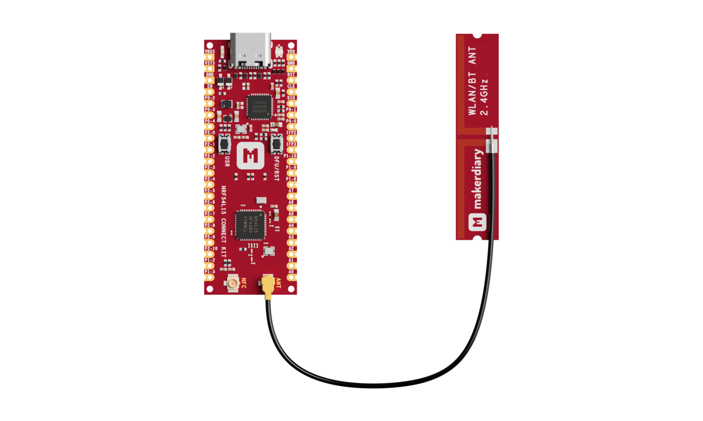

# Bluetooth Low Energy: Beacon

## Overview

The Bluetooth Low Energy Beacon sample demonstrates the GAP Broadcaster role functionality by advertising an Eddystone URL "https://makerdiary.com".

## Requirements

Before you start, check that you have the required hardware and software:

- 1x [nRF54L15 Connect Kit](https://makerdiary.com/products/nrf54l15-connectkit)
- 1x U.FL cabled 2.4 GHz Antenna (included in the box)
- 1x USB-C Cable
- A smartphone or a tablet with [nRF Connect for Mobile] installed
- A computer running macOS, Ubuntu, or Windows 10 or newer

## Attaching the 2.4 GHz antenna

Before applying power to the board, ensure the U.FL cabled 2.4 GHz antenna is properly installed.



## Building the sample

To build the sample, follow the instructions in [Getting Started Guide] to set up your preferred building environment.

Use the following steps to build the [Beacon] sample on the command line.

1. Open a terminal window.

2. Go to `NCS-Project/nrf54l15-connectkit` repository cloned in the [Getting Started Guide].

3. Build the sample using the `west build` command, specifying the board (following the `-b` option) as `nrf54l15_connectkit/nrf54l15/cpuapp`.

	``` bash
	west build -p always -b nrf54l15_connectkit/nrf54l15/cpuapp samples/bluetooth/beacon
	```

	!!! Tip
		The `-p` always option forces a pristine build, and is recommended for new users. Users may also use the `-p auto` option, which will use heuristics to determine if a pristine build is required, such as when building another sample.

4. After building the sample successfully, the firmware with the name `merged.hex` can be found in the `build` directory.

## Flashing the firmware

Connect the nRF54L15 Connect Kit to the computer with a USB-C cable:


Then flash the sample using `west flash`:

``` bash
west flash
```

!!! Tip
	In case you wonder, the `west flash` will execute the following command:

	``` bash
	pyocd load --target nrf54l --frequency 4000000 build/merged.hex
	```

## Testing

After programming the sample, test it by performing the following steps:

1. Open up a serial terminal, specifying the primary COM port that your computer uses to communicate with the nRF54L15:

	=== "Windows"

		1. Start [PuTTY].
		2. Configure the correct serial port and click __Open__:

			

	=== "macOS"

		Open up a terminal and run:

		``` bash
		screen <serial-port-name> 115200
		```

	=== "Ubuntu"

		Open up a terminal and run:

		``` bash
		screen <serial-port-name> 115200
		```

2. Press the __DFU/RST__ button to reset the nRF54L15.

3. Observe the output of the terminal. You should see the output, similar to what is shown in the following:

	``` { .txt .no-copy linenums="1" title="Terminal" }
	*** Booting nRF Connect SDK v3.1.0-6c6e5b32496e ***
	*** Using Zephyr OS v4.1.99-1612683d4010 ***
	Starting Beacon Demo
	[00:14:15.167,500] <inf> bt_sdc_hci_driver: SoftDevice Controller build revision:
												fc de 41 eb a2 d1 42 24  00 b5 f8 57 9f ac 9d 9e |..A...B$ ...W....
												aa c9 b4 34                                      |...4
	[00:14:15.168,398] <inf> bt_hci_core: HW Platform: Nordic Semiconductor (0x0002)
	[00:14:15.168,412] <inf> bt_hci_core: HW Variant: nRF54Lx (0x0005)
	[00:14:15.168,424] <inf> bt_hci_core: Firmware: Standard Bluetooth controller (0x00) Version 252.16862 Build 1121034987
	[00:14:15.168,782] <inf> bt_hci_core: HCI transport: SDC
	[00:14:15.168,830] <inf> bt_hci_core: Identity: EF:11:48:A5:EA:6D (random)
	[00:14:15.168,844] <inf> bt_hci_core: HCI: version 6.1 (0x0f) revision 0x3069, manufacturer 0x0059
	[00:14:15.168,857] <inf> bt_hci_core: LMP: version 6.1 (0x0f) subver 0x3069
	Bluetooth initialized
	Beacon started, advertising as EF:11:48:A5:EA:6D (random)
	```

4. Open the [nRF Connect for Mobile] app, scan the device and observe that the beacon is advertising an Eddystone URL (https://makerdiary.com) with the Device Name __Test beacon__.

	

[nRF Connect for Mobile]: https://www.nordicsemi.com/Products/Development-tools/nRF-Connect-for-mobile
[Getting Started Guide]: ../../getting-started.md
[Beacon]: https://github.com/makerdiary/nrf54l15-connectkit/tree/main/samples/bluetooth/beacon
[PuTTY]: https://apps.microsoft.com/store/detail/putty/XPFNZKSKLBP7RJ
