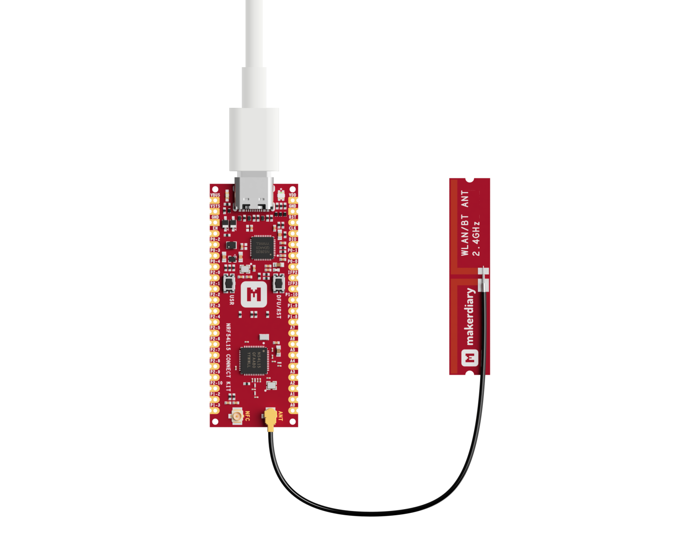

# Bluetooth Low Energy: Channel Sounding

## Overview

This section provides instructions on utilizing the Bluetooth® Low Energy (BLE) Channel Sounding feature, which enables high-precision ranging measurements between devices. The feature involves two primary roles: __Initiator with Ranging Requestor__ and __Reflector with Ranging Responder__.

<div class="grid cards" markdown>

-   __Initiator with Ranging Requestor__

	---

	Act as a GATT Ranging Requestor client and configures the Channel Sounding initiator role.

	[:octicons-arrow-right-24: View Code][Initiator with Ranging Requestor]

-   __Reflector with Ranging Responder__

	---

	Expose the GATT Ranging Responder Service and configures the Channel Sounding reflector role.

	[:octicons-arrow-right-24: View Code][Reflector with Ranging Responder]

</div>

## Requirements

Before you start, check that you have the required hardware and software:

- 2x [nRF54L15 Connect Kit](https://makerdiary.com/products/nrf54l15-connectkit) with U.FL cabled 2.4 GHz Antenna
- 2x USB-C Cable
- A computer running macOS, Ubuntu, or Windows 10 or newer

## Attaching the 2.4 GHz antenna

Before applying power to the board, ensure the U.FL cabled 2.4 GHz antenna is properly installed.


## Building the samples

To build the samples, follow the instructions in [Getting Started Guide] to set up your preferred building environment.

Use the following steps to build the [Initiator with Ranging Requestor] and [Reflector with Ranging Responder] samples on the command line.

1. Open a terminal window.

2. Go to `NCS-Project/nrf54l15-connectkit` repository cloned in the [Getting Started Guide].

3. Build the sample using the `west build` command, specifying the board (following the `-b` option) as `nrf54l15_connectkit/nrf54l15/cpuapp`.

	=== "Initiator"

		``` bash
		west build -p always -b nrf54l15_connectkit/nrf54l15/cpuapp samples/bluetooth/channel_sounding_ras_initiator
		```

	=== "Reflector"

		``` bash
		west build -p always -b nrf54l15_connectkit/nrf54l15/cpuapp samples/bluetooth/channel_sounding_ras_reflector
		```

	!!! Tip
		The `-p` always option forces a pristine build, and is recommended for new users. Users may also use the `-p auto` option, which will use heuristics to determine if a pristine build is required, such as when building another sample.

4. After building the sample successfully, the firmware with the name `merged.hex` can be found in the `build` directory.

## Flashing the firmware

Connect the nRF54L15 Connect Kit to the computer with a USB-C cable:



Then flash one device with the initiator application, and another device with the reflector application:

``` bash
west flash
```

!!! Tip
	In case you wonder, the `west flash` will execute the following command:

	``` bash
	pyocd load --target nrf54l --frequency 4000000 build/merged.hex
	```

## Testing

After programming the initiator and the reflector, test them by performing the following steps:

1. Open up a serial terminal for each device, specifying the primary COM port that your computer uses to communicate with the nRF54L15:

	=== "Windows"

		1. Start [PuTTY].
		2. Configure the correct serial port and click __Open__:

			

	=== "macOS"

		Open up a terminal and run:

		``` bash
		screen <serial-port-name> 115200
		```

	=== "Ubuntu"

		Open up a terminal and run:

		``` bash
		screen <serial-port-name> 115200
		```

2. Press the __DFU/RST__ button to reset the nRF54L15.

3. Observe the output of the terminal. You should see the output, similar to what is shown in the following:

	=== "Initiator"

		``` { .txt .no-copy linenums="1" title="Terminal" }
		*** Booting nRF Connect SDK v3.1.0-6c6e5b32496e ***
		*** Using Zephyr OS v4.1.99-1612683d4010 ***
		I: Starting Channel Sounding Initiator Sample
		I: SoftDevice Controller build revision:
		I: fc de 41 eb a2 d1 42 24 |..A...B$
		I: 00 b5 f8 57 9f ac 9d 9e |...W....
		I: aa c9 b4 34             |...4
		I: HW Platform: Nordic Semiconductor (0x0002)
		I: HW Variant: nRF54Lx (0x0005)
		I: Firmware: Standard Bluetooth controller (0x00) Version 252.16862 Build 1121034987
		I: HCI transport: SDC
		I: Identity: EF:11:48:A5:EA:6D (random)
		I: HCI: version 6.1 (0x0f) revision 0x3069, manufacturer 0x0059
		I: LMP: version 6.1 (0x0f) subver 0x3069
		I: Filters matched. Address: F4:3D:C2:1E:6E:74 (random) connectable: 1
		I: Connecting
		I: Connected to F4:3D:C2:1E:6E:74 (random) (err 0x00)
		I: Security changed: F4:3D:C2:1E:6E:74 (random) level 2
		I: MTU exchange success (498)
		I: The discovery procedure succeeded
		I: Read RAS feature bits: 0x1
		I: CS capability exchange completed.
		I: CS config creation complete. ID: 0
		I: CS security enabled.
		I: CS procedures enabled:
		- config ID: 0
		- antenna configuration index: 0
		- TX power: 0 dbm
		- subevent length: 28198 us
		- subevents per event: 1
		- subevent interval: 0
		- event interval: 2
		- procedure interval: 5
		- procedure count: 0
		- maximum procedure length: 1000
		I: Distance estimates on antenna path 0: ifft: 1.610213, phase_slope: 2.249911, rtt: 13.750394
		I: Sleeping for a few seconds...
		I: Distance estimates on antenna path 0: ifft: 1.756596, phase_slope: 2.404551, rtt: 13.855685
		I: Sleeping for a few seconds...
		I: Distance estimates on antenna path 0: ifft: 1.756596, phase_slope: 2.046242, rtt: 13.543401
		I: Sleeping for a few seconds...
		I: Distance estimates on antenna path 0: ifft: 1.756596, phase_slope: 2.150647, rtt: 13.648731
		I: Sleeping for a few seconds...
		...
		```

	=== "Reflector"

		``` { .txt .no-copy linenums="1" title="Terminal" }
		*** Booting nRF Connect SDK v3.1.0-6c6e5b32496e ***
		*** Using Zephyr OS v4.1.99-1612683d4010 ***
		I: Starting Channel Sounding Reflector Sample
		I: SoftDevice Controller build revision:
		I: fc de 41 eb a2 d1 42 24 |..A...B$
		I: 00 b5 f8 57 9f ac 9d 9e |...W....
		I: aa c9 b4 34             |...4
		I: HW Platform: Nordic Semiconductor (0x0002)
		I: HW Variant: nRF54Lx (0x0005)
		I: Firmware: Standard Bluetooth controller (0x00) Version 252.16862 Build 1121034987
		I: HCI transport: SDC
		I: Identity: EF:11:48:A5:EA:6D (random)
		I: HCI: version 6.1 (0x0f) revision 0x3069, manufacturer 0x0059
		I: LMP: version 6.1 (0x0f) subver 0x3069
		I: Connected to EF:11:48:A5:EA:6D (random) (err 0x00)
		I: CS capability exchange completed.
		I: CS config creation complete. ID: 0
		I: CS security enabled.
		I: CS procedures enabled.
		...
		```

[Getting Started Guide]: ../../getting-started.md
[Initiator with Ranging Requestor]: https://github.com/makerdiary/nrf54l15-connectkit/tree/main/samples/bluetooth/channel_sounding_ras_initiator
[Reflector with Ranging Responder]: https://github.com/makerdiary/nrf54l15-connectkit/tree/main/samples/bluetooth/channel_sounding_ras_reflector
[PuTTY]: https://apps.microsoft.com/store/detail/putty/XPFNZKSKLBP7RJ
