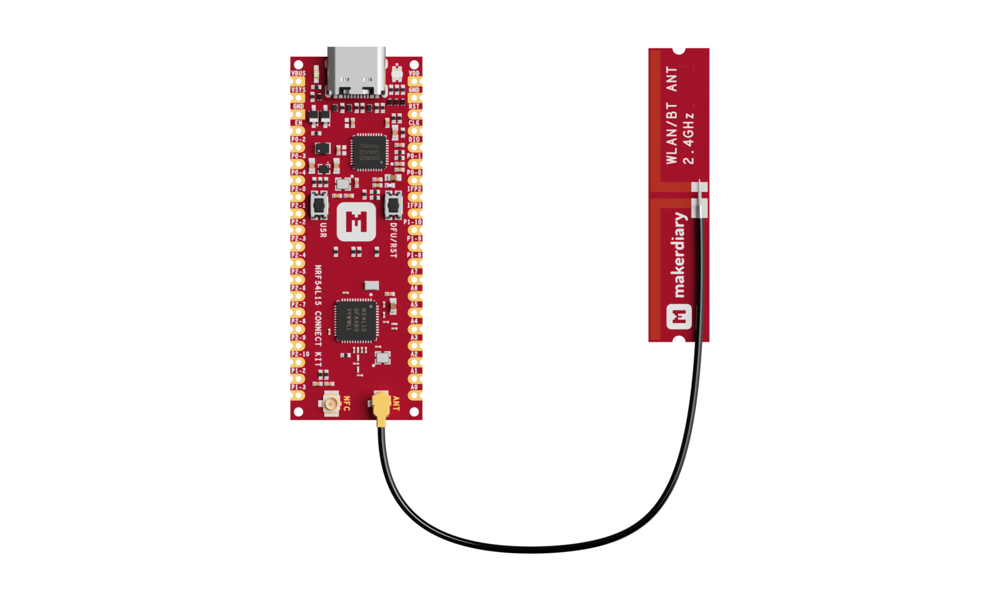
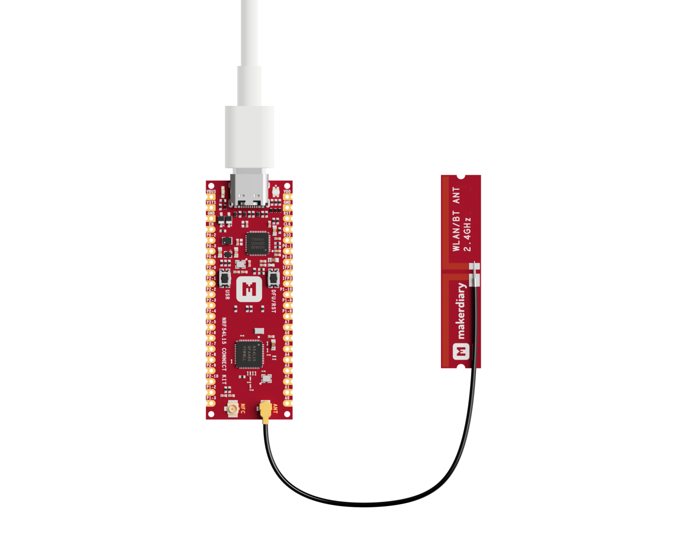
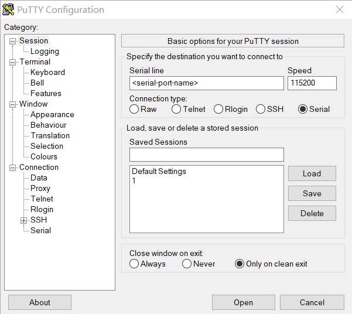

# Bluetooth Low Energy: Observer

## Overview

The Bluetooth Low Energy Observer sample demonstrates Bluetooth Low Energy Observer role functionality. The sample will periodically scan for devices nearby. If any found, prints the address of the device, the RSSI value, the Advertising type, and the Advertising data length to the console.

If the used Bluetooth Low Energy Controller supports Extended Scanning, you may enable __`CONFIG_BT_EXT_ADV`__ in the project configuration file. Refer to the project configuration file for further details.

## Requirements

Before you start, check that you have the required hardware and software:

- 1x [nRF54L15 Connect Kit](https://makerdiary.com/products/nrf54l15-connectkit)
- 1x U.FL cabled 2.4 GHz Antenna (included in the box)
- 1x USB-C Cable
- A computer running macOS, Ubuntu, or Windows 10 or newer

## Attaching the 2.4 GHz antenna

Before applying power to the board, ensure the U.FL cabled 2.4 GHz antenna is properly installed.



## Building the sample

To build the sample, follow the instructions in [Getting Started Guide] to set up your preferred building environment.

Use the following steps to build the [Observer] sample on the command line.

1. Open a terminal window.

2. Go to `NCS-Project/nrf54l15-connectkit` repository cloned in the [Getting Started Guide].

3. Build the sample using the `west build` command, specifying the board (following the `-b` option) as `nrf54l15_connectkit/nrf54l15/cpuapp`.

	=== "Default"

		``` bash
		west build -p always -b nrf54l15_connectkit/nrf54l15/cpuapp samples/bluetooth/observer
		```

	=== "Extended Scanning"

		``` bash
		west build -p always -b nrf54l15_connectkit/nrf54l15/cpuapp samples/bluetooth/observer -- -DCONF_FILE="prj_extended.conf"
		```

	!!! Tip
		The `-p` always option forces a pristine build, and is recommended for new users. Users may also use the `-p auto` option, which will use heuristics to determine if a pristine build is required, such as when building another sample.

4. After building the sample successfully, the firmware with the name `merged.hex` can be found in the `build` directory.

## Flashing the firmware

Connect the nRF54L15 Connect Kit to the computer with a USB-C cable:



Then flash the sample using `west flash`:

``` bash
west flash
```

!!! Tip
	In case you wonder, the `west flash` will execute the following command:

	``` bash
	pyocd load --target nrf54l --frequency 4000000 build/merged.hex
	```

## Testing

After programming the sample, test it by performing the following steps:

1. Open up a serial terminal, specifying the primary COM port that your computer uses to communicate with the nRF54L15:

	=== "Windows"

		1. Start [PuTTY].
		2. Configure the correct serial port and click __Open__:

			

	=== "macOS"

		Open up a terminal and run:

		``` bash
		screen <serial-port-name> 115200
		```

	=== "Ubuntu"

		Open up a terminal and run:

		``` bash
		screen <serial-port-name> 115200
		```

2. Press the __DFU/RST__ button to reset the nRF54L15.

3. Observe the output of the terminal. You should see the output, similar to what is shown in the following:

	=== "Default"

		``` { .txt .no-copy linenums="1" title="Terminal" }
		*** Booting nRF Connect SDK v3.1.0-preview2-3674486b55f7 ***
		*** Using Zephyr OS v4.1.99-701bd803eafa ***
		Starting Observer Demo
		Started scanning...
		Exiting main thread.
		Device found: 5D:AB:ED:FA:8A:D5 (random) (RSSI -51), type 0, AD data len 30
		Device found: 68:E4:78:39:7E:11 (public) (RSSI -66), type 0, AD data len 31
		Device found: A4:C1:38:9C:59:F2 (public) (RSSI -62), type 0, AD data len 17
		Device found: 73:87:FF:83:73:8B (random) (RSSI -75), type 0, AD data len 19
		...
		```

	=== "Extended Scanning"

		``` { .txt .no-copy linenums="1" title="Terminal" }
		*** Booting nRF Connect SDK v3.1.0-preview2-3674486b55f7 ***
		*** Using Zephyr OS v4.1.99-701bd803eafa ***
		Starting Observer Demo
		Started scanning...
		Exiting main thread.
		Device found: 5C:31:F6:32:10:26 (random) (RSSI -39), type 0, AD data len 17
		[DEVICE]: 5C:31:F6:32:10:26 (random), AD evt type 0, Tx Pwr: 127, RSSI -39 Data status: 0, AD data len: 17 Name:  C:1 S:1 D:0 SR:0 E:0 Pri PHY: LE 1M, Sec PHY: No packets, Interval: 0x0000 (0 ms), SID: 255
		Device found: 68:E4:78:39:7E:11 (public) (RSSI -64), type 0, AD data len 31
		[DEVICE]: 68:E4:78:39:7E:11 (public), AD evt type 0, Tx Pwr: 127, RSSI -64 Data status: 0, AD data len: 31 Name: U-RFR7E10 C:1 S:1 D:0 SR:0 E:0 Pri PHY: LE 1M, Sec PHY: No packets, Interval: 0x0000 (0 ms), SID: 255
		Device found: 40:2A:8F:4E:93:81 (public) (RSSI -90), type 0, AD data len 27
		[DEVICE]: 40:2A:8F:4E:93:81 (public), AD evt type 0, Tx Pwr: 127, RSSI -90 Data status: 0, AD data len: 27 Name:  C:1 S:1 D:0 SR:0 E:0 Pri PHY: LE 1M, Sec PHY: No packets, Interval: 0x0000 (0 ms), SID: 255
		...
		```

[nRF Connect for Mobile]: https://www.nordicsemi.com/Products/Development-tools/nRF-Connect-for-mobile
[Getting Started Guide]: ../../getting-started.md
[Observer]: https://github.com/makerdiary/nrf54l15-connectkit/tree/main/samples/bluetooth/observer
[PuTTY]: https://apps.microsoft.com/store/detail/putty/XPFNZKSKLBP7RJ
