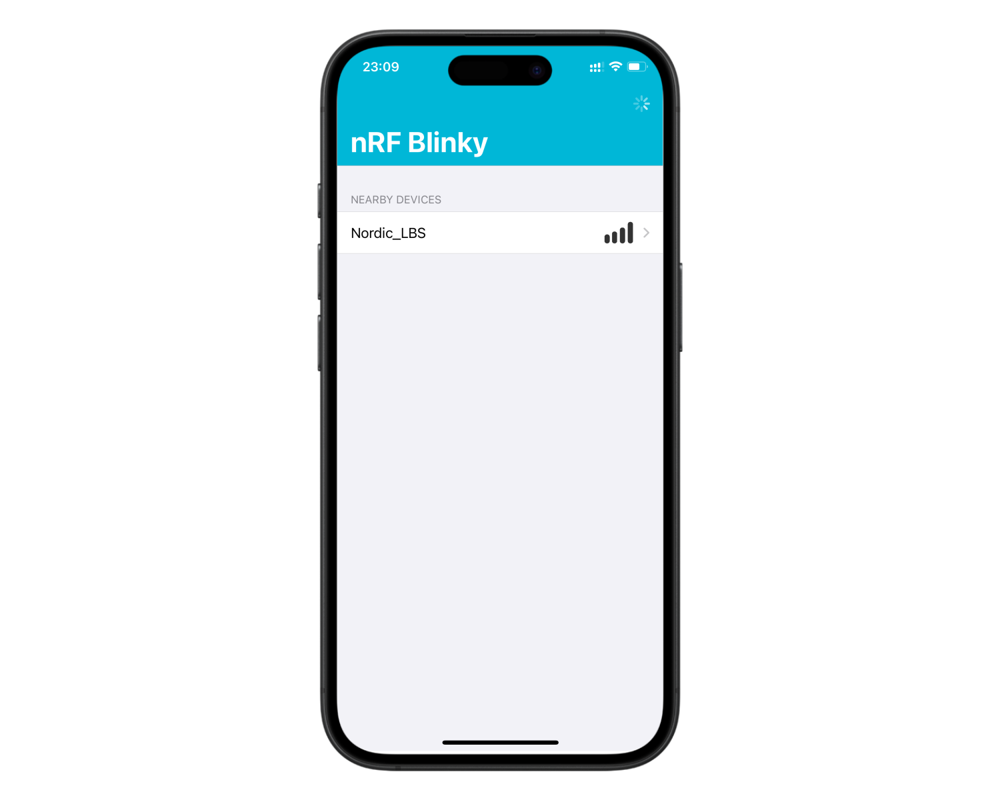
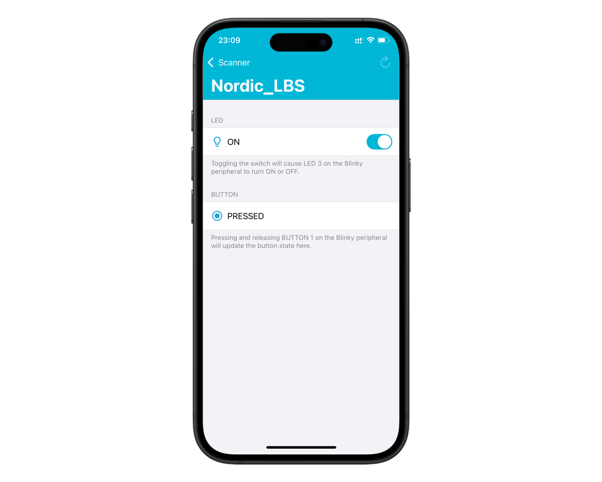

# Bluetooth Low Energy: Peripheral LBS

## Overview

The Peripheral LBS sample demonstrates how to use the [LED Button Service (LBS)].

When connected, the sample sends the state of __USR__ button on the board to the connected device, such as a phone or tablet. The mobile application on the device can display the received button state and control the state of __Green LED__ on the board.


## Requirements

Before you start, check that you have the required hardware and software:

- 1x [nRF54L15 Connect Kit](https://makerdiary.com/products/nrf54l15-connectkit)
- 1x U.FL cabled 2.4 GHz Antenna (included in the box)
- 1x USB-C Cable
- A smartphone or a tablet with [nRF Blinky] installed
- A computer running macOS, Ubuntu, or Windows 10 or newer

## Attaching the 2.4 GHz antenna

Before applying power to the board, ensure the U.FL cabled 2.4 GHz antenna is properly installed.


## Building the sample

To build the sample, follow the instructions in [Getting Started Guide] to set up your preferred building environment.

Use the following steps to build the [Peripheral LBS] sample on the command line.

1. Open a terminal window.

2. Go to `NCS-Project/nrf54l15-connectkit` repository cloned in the [Getting Started Guide].

3. Build the sample using the `west build` command, specifying the board (following the `-b` option) as `nrf54l15_connectkit/nrf54l15/cpuapp`.

	``` bash
	west build -p always -b nrf54l15_connectkit/nrf54l15/cpuapp samples/bluetooth/peripheral_lbs
	```

	!!! Tip
		The `-p` always option forces a pristine build, and is recommended for new users. Users may also use the `-p auto` option, which will use heuristics to determine if a pristine build is required, such as when building another sample.

4. After building the sample successfully, the firmware with the name `merged.hex` can be found in the `build` directory.

## Flashing the firmware

Connect the nRF54L15 Connect Kit to the computer with a USB-C cable:


Then flash the sample using `west flash`:

``` bash
west flash
```

!!! Tip
	In case you wonder, the `west flash` will execute the following command:

	``` bash
	pyocd load --target nrf54l --frequency 4000000 build/merged.hex
	```

## Testing

After programming the sample, test it by performing the following steps:

1. Open up a serial terminal, specifying the primary COM port that your computer uses to communicate with the nRF54L15:

	=== "Windows"

		1. Start [PuTTY].
		2. Configure the correct serial port and click __Open__:

			

	=== "macOS"

		Open up a terminal and run:

		``` bash
		screen <serial-port-name> 115200
		```

	=== "Ubuntu"

		Open up a terminal and run:

		``` bash
		screen <serial-port-name> 115200
		```

2. Press the __DFU/RST__ button to reset the nRF54L15.

3. Observe the output of the terminal. You should see the output, similar to what is shown in the following:

	``` { .txt .no-copy linenums="1" title="Terminal" }
	*** Booting nRF Connect SDK v3.1.0-preview2-3674486b55f7 ***
	*** Using Zephyr OS v4.1.99-701bd803eafa ***
	Starting Bluetooth Peripheral LBS sample
	Bluetooth initialized
	Advertising successfully started
	```

4. Open the [nRF Blinky] app, observe that the board is advertising with the Device Name __Nordic_LBS__.

	

5. Tap __Nordic_LBS__ to establish a connection with the board, then:

	- Toggle the LED switch in the app to turn the __Green LED__ ON/OFF
	- Press the __USR__ button on the board, and the app will show its state (Pressed/Released)

	


[LED Button Service (LBS)]: https://docs.nordicsemi.com/bundle/ncs-latest/page/nrf/libraries/bluetooth/services/lbs.html#lbs-readme
[nRF Blinky]: https://www.nordicsemi.com/Products/Development-tools/nRF-Blinky
[Getting Started Guide]: ../../getting-started.md
[Peripheral LBS]: https://github.com/makerdiary/nrf54l15-connectkit/tree/main/samples/bluetooth/peripheral_lbs
[PuTTY]: https://apps.microsoft.com/store/detail/putty/XPFNZKSKLBP7RJ
