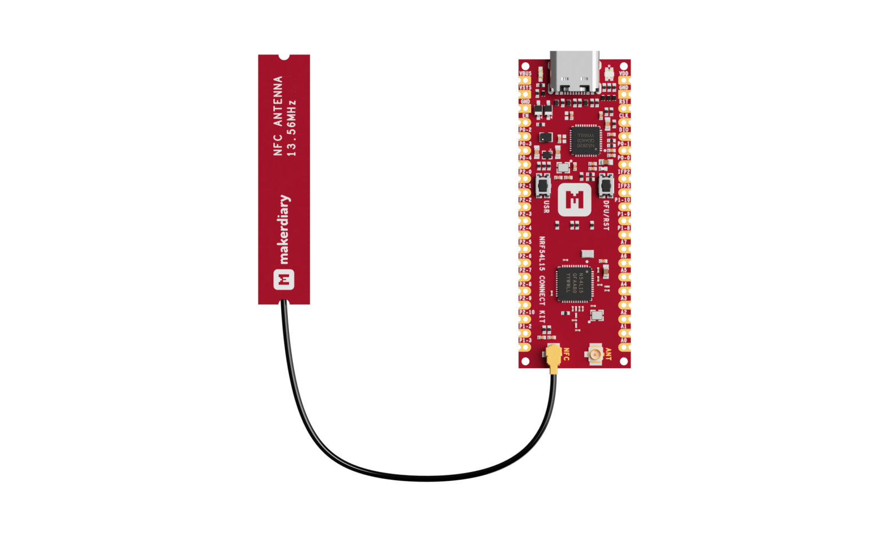

# NFC Writable NDEF Message

## Overview

The NFC Writable NDEF Message sample shows how to use the NFC tag to expose an NDEF message that can be overwritten with any other NDEF message by an NFC device. It uses the [NFC Data Exchange Format (NDEF)] library.

When the sample starts, it initializes the NFC tag and loads the NDEF message from the file in flash memory. If the NDEF message file does not exist, a default message is generated. It is a URI message with a URI record containing the URL "https://makerdiary.com". The sample then sets up the NFC library for the Type 4 Tag platform, which uses the NDEF message and senses the external NFC field.

The library works in Read-Write emulation mode. In this mode, procedures for reading and updating an NDEF message are handled internally by the NFC library. Any changes to the NDEF message update the NDEF message file stored in flash memory.

The __Green LED__ indicates if an NFC field is present. Press the __USR__ button during startup to restore the default NDEF message.

## Requirements

Before you start, check that you have the required hardware and software:

- 1x [nRF54L15 Connect Kit](https://makerdiary.com/products/nrf54l15-connectkit)
- 1x U.FL cabled 13.56 MHz NFC Antenna (included in the box)
- 1x USB-C Cable
- A smartphone or a tablet with NFC support
- A computer running macOS, Ubuntu, or Windows 10 or newer

## Installing NFC Tools App

NFC Tools App can read and write your NFC tags with a simple and lightweight user interface.

[{ width='128' display='inline' }](https://apps.apple.com/us/app/nfc-tools/id1252962749)
[{ width='148' display='inline' }](https://play.google.com/store/apps/details?id=com.wakdev.wdnfc)

## Attaching the NFC antenna

Before applying power to the board, ensure the U.FL cabled NFC antenna is properly installed.




## Building the sample

To build the sample, follow the instructions in [Getting Started Guide] to set up your preferred building environment.

Use the following steps to build the [NFC Writable NDEF Message] sample on the command line.

1. Open a terminal window.

2. Go to `NCS-Project/nrf54l15-connectkit` repository cloned in the [Getting Started Guide].

3. Build the sample using the `west build` command, specifying the board (following the `-b` option) as `nrf54l15_connectkit/nrf54l15/cpuapp`.

	``` bash
	west build -p always -b nrf54l15_connectkit/nrf54l15/cpuapp samples/nfc/writable_ndef_msg
	```

	!!! Tip
		The `-p` always option forces a pristine build, and is recommended for new users. Users may also use the `-p auto` option, which will use heuristics to determine if a pristine build is required, such as when building another sample.

4. After building the sample successfully, the firmware with the name `merged.hex` can be found in the `build` directory.

## Flashing the firmware

Connect the nRF54L15 Connect Kit to the computer with a USB-C cable:


Then flash the sample using `west flash`:

``` bash
west flash
```

!!! Tip
	In case you wonder, the `west flash` will execute the following command:

	``` bash
	pyocd load --target nrf54l --frequency 4000000 build/merged.hex
	```

## Testing

After programming the sample, test it by performing the following steps:

1. Open up a serial terminal, specifying the primary COM port that your computer uses to communicate with the nRF54L15:

	=== "Windows"

		1. Start [PuTTY].
		2. Configure the correct serial port and click __Open__:

			

	=== "macOS"

		Open up a terminal and run:

		``` bash
		screen <serial-port-name> 115200
		```

	=== "Ubuntu"

		Open up a terminal and run:

		``` bash
		screen <serial-port-name> 115200
		```

2. Press the __DFU/RST__ button to reset the nRF54L15.

3. Once the sample starts running, you should see the following output:

	``` { .bash .no-copy linenums="1" title="Terminal" }
	*** Booting nRF Connect SDK v3.1.0-6c6e5b32496e ***
	*** Using Zephyr OS v4.1.99-1612683d4010 ***
	Starting NFC Writable NDEF Message sample
	NDEF file record not found, creating default NDEF.
	```

4. Touch the NFC antenna with the smartphone or tablet and observe that Green LED blinks.

5. Observe that the smartphone or tablet tries to open the URL "https://makerdiary.com" in a web browser.

6. Open NFC Tools app, tap the __Write__ tab at the bottom of the screen and tap __+ Add a record__ to add your new NDEF records.

7. Tap __Write__ and touch the NFC antenna again to write the new message. If successful, you will see the following output:

	``` { .bash .no-copy linenums="5" title="Terminal" }
	NDEF message successfully flashed.
	```

8. Go back to the __Read__ tab and rescan the tag to confirm your new message appears. 

[NFC Data Exchange Format (NDEF)]: https://docs.nordicsemi.com/bundle/ncs-latest/page/nrf/libraries/nfc/ndef/index.html#lib-nfc-ndef
[Getting Started Guide]: ../../getting-started.md
[NFC Writable NDEF Message]: https://github.com/makerdiary/nrf54l15-connectkit/tree/main/samples/nfc/writable_ndef_msg
[PuTTY]: https://apps.microsoft.com/store/detail/putty/XPFNZKSKLBP7RJ

