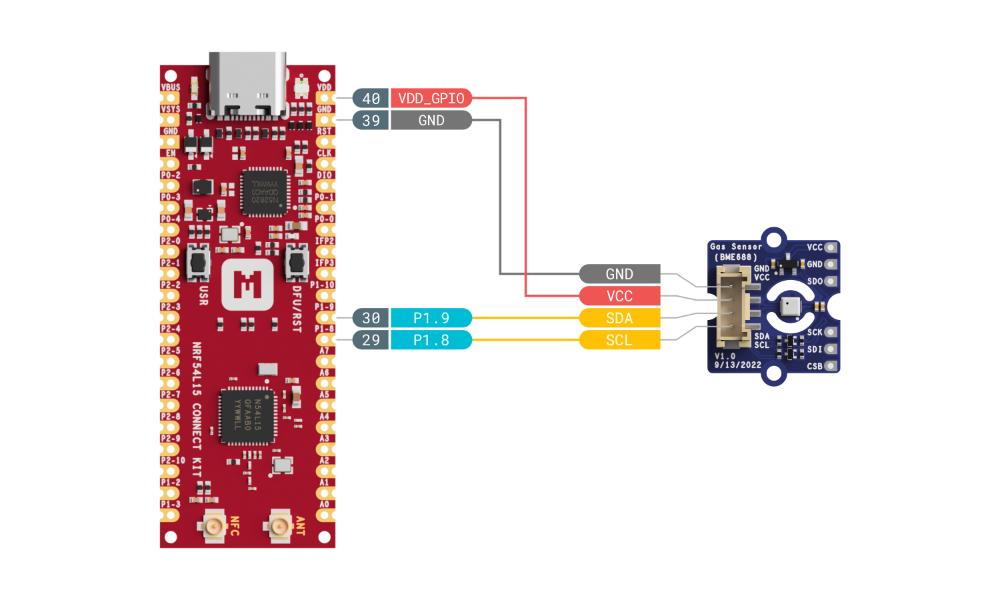

# BME68X Gas Sensor

## Overview

The BME68X Gas Sensor sample sets up the BME68X gas sensor with the Bosch Sensor Environmental Cluster (BSEC) library.

Here is the overlay file which supports this sample.

``` dts linenums="1" title="nrf54l15_connectkit_nrf54l15_cpuapp.overlay"
&pinctrl {
	i2c22_default: i2c22_default {
		group1  {
			psels = <NRF_PSEL(TWIM_SCL, 1, 8)>,
					<NRF_PSEL(TWIM_SDA, 1, 9)>;
		};
	};

	i2c22_sleep: i2c22_sleep {
		group1  {
			psels = <NRF_PSEL(TWIM_SCL, 1, 8)>,
					<NRF_PSEL(TWIM_SDA, 1, 9)>;
			low-power-enable;
		};
	};
};

&i2c22 {
	status = "okay";
	zephyr,concat-buf-size = <512>;
	pinctrl-0 = <&i2c22_default>;
	pinctrl-1 = <&i2c22_sleep>;
	pinctrl-names = "default", "sleep";

	bme688: bme688@76 {
		compatible = "bosch,bme680";
		status = "okay";
		reg = <0x76>;
	};
};
```

## Requirements

Before you start, check that you have the required hardware and software:

- 1x [nRF54L15 Connect Kit](https://makerdiary.com/products/nrf54l15-connectkit)
- 1x USB-C Cable
- 1x BME688 Sensor (e.g., Seeed Studio's [Grove - Air Quality Sensor(BME688)])
- A computer running macOS, Ubuntu, or Windows 10 or newer

## Wiring the sensor

Refer to the following figure for proper BME688 sensor connection to the nRF54L15 Connect Kit before applying power.



## Building the sample

To build the sample, follow the instructions in [Getting Started Guide] to set up your preferred building environment.

You can use the BME68X IAQ driver to run the Bosch Sensor Environmental Cluster (BSEC) library in order to get Indoor Air Quality (IAQ) readings.

The BSEC library is distributed with a Bosch proprietary license ([BSEC license]) that prevents it from being part of nRF Connect SDK. To start using it, you have to accept the license and enable the download by running the following commands in the `nrf` folder:

``` bash linenums="1"
west config manifest.group-filter +bsec
```

``` bash linenums="2"
west update
```

Use the following steps to build the [BME68X Gas Sensor] sample on the command line.

1. Open a terminal window.

2. Go to `NCS-Project/nrf54l15-connectkit` repository cloned in the [Getting Started Guide].

3. Build the sample using the `west build` command, specifying the board (following the `-b` option) as `nrf54l15_connectkit/nrf54l15/cpuapp`.

	``` bash
	west build -p always -b nrf54l15_connectkit/nrf54l15/cpuapp samples/sensor/bme68x_iaq
	```

	!!! Tip
		The `-p` always option forces a pristine build, and is recommended for new users. Users may also use the `-p auto` option, which will use heuristics to determine if a pristine build is required, such as when building another sample.

4. After building the sample successfully, the firmware with the name `merged.hex` can be found in the `build` directory.

## Flashing the firmware

Connect the nRF54L15 Connect Kit to the computer with a USB-C cable:


Then flash the sample using `west flash`:

``` bash
west flash
```

!!! Tip
	In case you wonder, the `west flash` will execute the following command:

	``` bash
	pyocd load --target nrf54l --frequency 4000000 build/merged.hex
	```

## Testing

After programming the sample, test it by performing the following steps:

1. Open up a serial terminal, specifying the primary COM port that your computer uses to communicate with the nRF54L15:

	=== "Windows"

		1. Start [PuTTY].
		2. Configure the correct serial port and click __Open__:

			

	=== "macOS"

		Open up a terminal and run:

		``` bash
		screen <serial-port-name> 115200
		```

	=== "Ubuntu"

		Open up a terminal and run:

		``` bash
		screen <serial-port-name> 115200
		```

2. Press the __DFU/RST__ button to reset the nRF54L15.

3. Observe the output of the terminal. You should see the output, similar to what is shown in the following:

	``` { .txt .no-copy linenums="1" title="Terminal" }
	*** Booting nRF Connect SDK v3.1.0-rc1-8505887182fe ***
	*** Using Zephyr OS v4.1.99-797a60e8542a ***
	[00:00:00.019,106] <inf> app: App started
	[00:00:06.044,229] <inf> app: temp: 29.605730; press: 99450.281250; humidity: 73.636467; iaq: 50; CO2: 500.000000; VOC: 0.499999
	[00:00:09.044,289] <inf> app: temp: 28.835971; press: 99446.812500; humidity: 76.732482; iaq: 50; CO2: 500.000000; VOC: 0.499999
	[00:00:12.044,412] <inf> app: temp: 28.715774; press: 99448.398437; humidity: 77.680435; iaq: 50; CO2: 500.000000; VOC: 0.499999
	[00:00:15.044,503] <inf> app: temp: 28.667188; press: 99448.679687; humidity: 78.038581; iaq: 50; CO2: 500.000000; VOC: 0.499999
	[00:00:18.044,594] <inf> app: temp: 28.593027; press: 99448.296875; humidity: 78.303268; iaq: 50; CO2: 500.000000; VOC: 0.499999
	[00:00:21.044,701] <inf> app: temp: 28.562335; press: 99448.992187; humidity: 78.380111; iaq: 50; CO2: 500.000000; VOC: 0.499999
	[00:00:24.044,839] <inf> app: temp: 28.523975; press: 99451.179687; humidity: 78.461883; iaq: 50; CO2: 500.000000; VOC: 0.499999
	...
	```

	!!! Note
		BSEC takes about 24 hours to calibrate the indoor air quality (IAQ) output.

[Grove - Air Quality Sensor(BME688)]: https://www.seeedstudio.com/Grove-Gas-Sensor-BME688-p-5478.html
[Getting Started Guide]: ../../getting-started.md
[BSEC license]: https://www.bosch-sensortec.com/media/boschsensortec/downloads/software/bme688_development_software/2023_04/license_terms_bme688_bme680_bsec.pdf
[BME68X Gas Sensor]: https://github.com/makerdiary/nrf54l15-connectkit/tree/main/samples/sensor/bme68x_iaq
[PuTTY]: https://apps.microsoft.com/store/detail/putty/XPFNZKSKLBP7RJ
