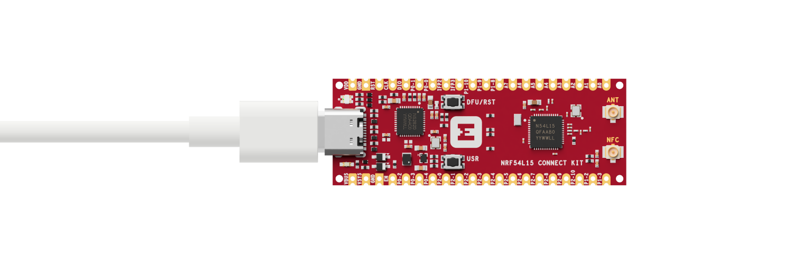

# System OFF

## Overview

The System OFF sample can be used for basic power measurement and as an example of deep sleep on the nRF54L15 Connect Kit.

This sample can also demonstrate RAM retention. By selecting __`CONFIG_APP_USE_RETAINED_MEM=y`__ state related to number of boots, number of times system off was entered, and total uptime since initial power-on are retained in a checksummed data structure. RAM is configured to keep the containing section powered while in system-off mode.

## Requirements

Before you start, check that you have the required hardware and software:

- 1x [nRF54L15 Connect Kit](https://makerdiary.com/products/nrf54l15-connectkit)
- 1x USB-C Cable
- A computer running macOS, Ubuntu, or Windows 10 or newer

## Building the sample

To build the sample, follow the instructions in [Getting Started Guide] to set up your preferred building environment.

Use the following steps to build the [System OFF] sample on the command line.

1. Open a terminal window.

2. Go to `NCS-Project/nrf54l15-connectkit` repository cloned in the [Getting Started Guide].

3. Build the sample using the `west build` command, specifying the board (following the `-b` option) as `nrf54l15_connectkit/nrf54l15/cpuapp`.

	=== "Default"

		``` bash
		west build -p always -b nrf54l15_connectkit/nrf54l15/cpuapp samples/system_off
		```
	
	=== "RAM retention"

		``` bash
		west build -p always -b nrf54l15_connectkit/nrf54l15/cpuapp samples/system_off -- -DCONFIG_APP_USE_RETAINED_MEM=y
		```

	!!! Tip
		The `-p` always option forces a pristine build, and is recommended for new users. Users may also use the `-p auto` option, which will use heuristics to determine if a pristine build is required, such as when building another sample.

4. After building the sample successfully, the firmware with the name `merged.hex` can be found in the `build` directory.

## Flashing the firmware

Connect the nRF54L15 Connect Kit to the computer with a USB-C cable:



Then flash the sample using `west flash`:

``` bash
west flash
```

!!! Tip
	In case you wonder, the `west flash` will execute the following command:

	``` bash
	pyocd load --target nrf54l --frequency 4000000 build/merged.hex
	```

## Testing

After programming the sample, test it by performing the following steps:

1. Open up a serial terminal, specifying the primary COM port that your computer uses to communicate with the nRF54L15:

	=== "Windows"

		1. Start [PuTTY].
		2. Configure the correct serial port and click __Open__:

			

	=== "macOS"

		Open up a terminal and run:

		``` bash
		screen <serial-port-name> 115200
		```

	=== "Ubuntu"

		Open up a terminal and run:

		``` bash
		screen <serial-port-name> 115200
		```

2. Press the __DFU/RST__ button to reset the nRF54L15.

3. Observe the output of the terminal. You should see the output, similar to what is shown in the following:

	=== "Default"

		``` { .txt .no-copy linenums="1" title="Terminal" }
		*** Booting nRF Connect SDK v3.1.0-6c6e5b32496e ***
		*** Using Zephyr OS v4.1.99-1612683d4010 ***

		nrf54l15_connectkit system off demo
		Other wake up cause 0x00000001.
		Retained data not supported
		Entering system off; press sw0 to restart
		*** Booting nRF Connect SDK v3.1.0-6c6e5b32496e ***
		*** Using Zephyr OS v4.1.99-1612683d4010 ***

		nrf54l15_connectkit system off demo
		Wakeup from System OFF by GPIO.
		Retained data not supported
		Entering system off; press sw0 to restart
		...
		```

	=== "RAM retention"

		``` { .txt .no-copy linenums="1" title="Terminal" }
		*** Booting nRF Connect SDK v3.1.0-6c6e5b32496e ***
		*** Using Zephyr OS v4.1.99-1612683d4010 ***

		nrf54l15_connectkit system off demo
		Other wake up cause 0x00000001.
		Retained data: valid
		Boot count: 1
		Off count: 0
		Active Ticks: 548
		Entering system off; press sw0 to restart
		*** Booting nRF Connect SDK v3.1.0-6c6e5b32496e ***
		*** Using Zephyr OS v4.1.99-1612683d4010 ***

		nrf54l15_connectkit system off demo
		Wakeup from System OFF by GPIO.
		Retained data: valid
		Boot count: 2
		Off count: 1
		Active Ticks: 317829
		Entering system off; press sw0 to restart
		...
		```

[Getting Started Guide]: ../getting-started.md
[System OFF]: https://github.com/makerdiary/nrf54l15-connectkit/tree/main/samples/system_off
[PuTTY]: https://apps.microsoft.com/store/detail/putty/XPFNZKSKLBP7RJ
