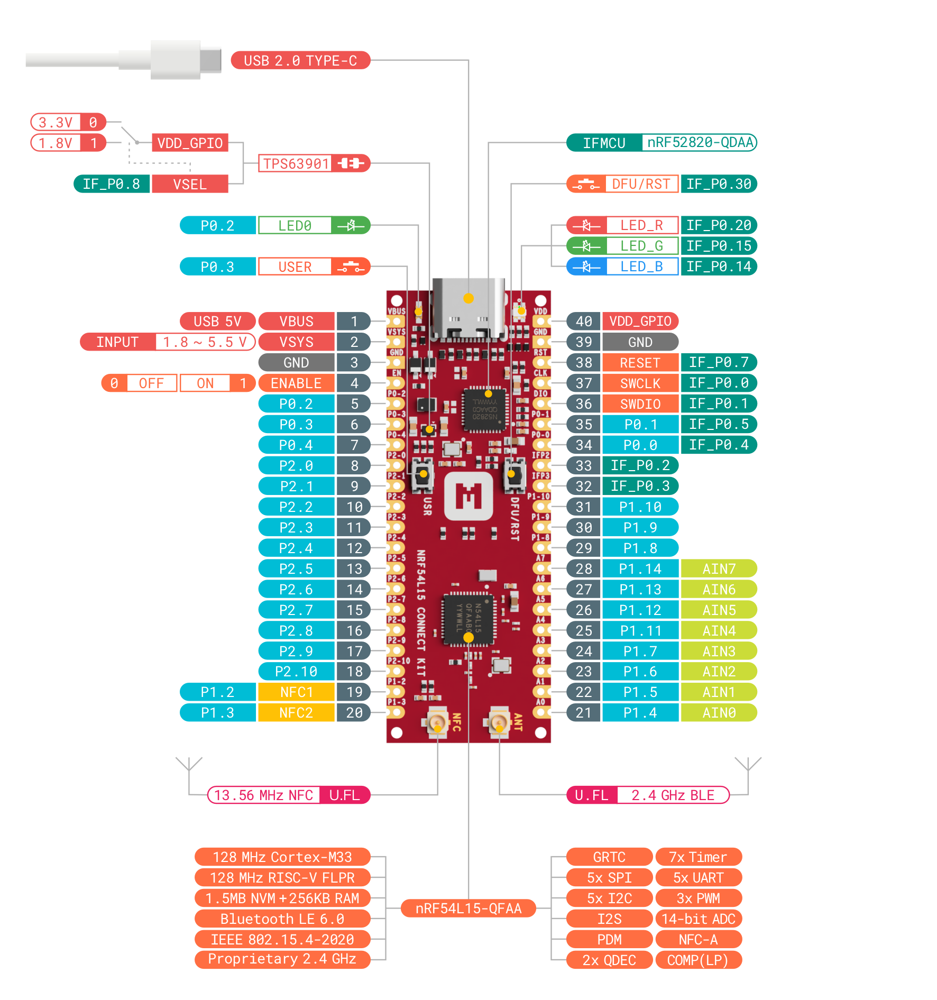
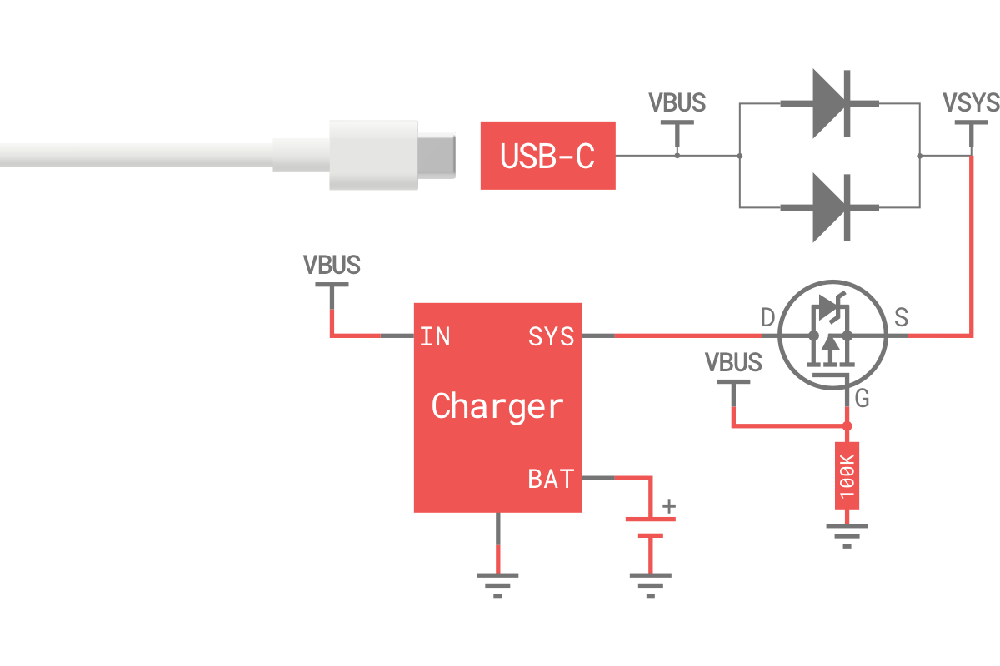

# Hardware description

This section of the documentation specifies and describes the nRF54L15 Connect Kit mainly from a hardware point of view.

## Hardware diagram

The following figure illustrates the nRF54L15 Connect Kit hardware diagram. The design has loose or pre-soldered pin headers available.

[][HW Diagram PDF]

[][HW Diagram PDF]

## Mechanical dimensions

The nRF54L15 Connect Kit is a 4-layer chem. Gold, 55.88mm x 20.32mm (2.2" x 0.8") 1mm thick PCB with a USB Type-C port, LEDs, Buttons, U.FL receptacles and 40x castellated/through-hole pins.

[:material-folder-download: Download DXF Files][Board DXF Files]

## Power supply

The nRF54L15 Connect Kit can be powered through either the USB-C port or the __VSYS__ pin (1.8-5.5V input range). The board contains a [TPS63901] buck-boost converter with 75-nA quiescent current and 1.8V/3.3V configurable power supply for I/Os.

The following figure describes the power supply architecture:

__VBUS__ is the __5V__ input from the USB-C port. There are two parallel Schottky diodes between __VBUS__ and __VSYS__, which add flexibility by allowing power ORing of different supplies into __VSYS__.

Set __ENABLE__ __`HIGH`__ to enable __VDD_GPIO__ output and __`LOW`__ to disable __VDD_GPIO__ output. This pin has a pull-up resistor (1MOhm) and can be tied to __GND__ to place the board in Power-Down mode.

__IF_P0.8__ controls __VDD_GPIO__ voltage selection: __`HIGH`__ = __1.8 V__, __`LOW`__ = __3.3 V__. This pin has a pull-down resistor (1MOhm), which sets the default __VDD_GPIO__ voltage to __3.3 V__.

!!! example "Powering the board"

    The nRF54L15 Connect Kit features flexible power management, supporting USB-C, external power supplies, or batteries.

    === "Using USB-C port"

        This is the simplest way to power the board, which will power __VSYS__ (and therefore the system) from the 5V USB __VBUS__ voltage, through two internal Schottky diodes (so __VSYS__ becomes __VBUS__ minus the Schottky diode forward voltage).

        

    === "Feeding VSYS directly"

        If the USB-C port is __NOT__ going to be used, it is safe to power the board by directly connecting __VSYS__ to your preferred power source (in the range 1.8V to 5.5V).

        

    === "Feeding VSYS via a Schottky diode"

        To safely add a second power source to the board, simply feed __VSYS__ through an external Schottky diode.

        

    === "Feeding VSYS via a P-MOSFET"

        An improved way to power from a second source is using an external P-MOSFET to replace the Schottky diode as shown in the following figure.

        

    === "Using a battery charger"

        The nRF54L15 Connect Kit can be also used with a battery charger with power path manager which will automatically and seamlessly switch between the input source and the battery power.

        

## Interface MCU

The nRF54L15 Connect Kit features an [nRF52820]-based Interface MCU that enables onboard debugging and programming, eliminating the need for external tools. The Interface MCU also includes a USB-UART bridge for log, trace and terminal emulation, and an Interface Shell bundled with helpful commands to access the board-specific functionality.

The following figure describes the functional architecture of the Interface MCU:

The following table describes the pin functions of the Interface MCU:

| Pin name | Description |
|----------|-------------|
| P0.0     | GPIO pin used for SWCLK output. Connect to the SWCLK pin of nRF54L15. |
| P0.1     | GPIO pin used for SWDIO input/output. Connect to the SWDIO pin of nRF54L15. |
| P0.2     | General purpose I/O.   SDA pin of the I2C bus. |
| P0.3     | General purpose I/O.   SCL pin of the I2C bus. |
| P0.4/RX  | RXD pin of the UART bridge. Connect to the P0.0 pin of nRF54L15. |
| P0.5/TX  | TXD pin of the UART bridge. Connect to the P0.1 pin of nRF54L15. |
| P0.7     | GPIO pin used for RESET output. Connect to the RESET pin of nRF54L15. |
| P0.8     | GPIO pin used to select the voltage of __VDD_GPIO__. Connect to the SEL pin of TPS63901 through a 1-MΩ pulldown resistor. Selects 1.8V when a high level is applied to this pin. Selects 3.3V when a low level is applied to this pin. |
| P0.14    | GPIO pin used to control the Blue LED of RGB LED driven by a MOS switch. A high level applied to this pin turns on the LED and a low level turns it off. |
| P0.15    | GPIO pin used to control the Green LED of RGB LED driven by a MOS switch. A high level applied to this pin turns on the LED and a low level turns it off. |
| P0.20    | GPIO pin used to control the Red LED of RGB LED driven by a MOS switch. A high level applied to this pin turns on the LED and a low level turns it off. |
| P0.30    | GPIO pin used to detect button press of the DFU/RST button. This pin pulls to GND when the button is pressed. |

## General purpose I/Os

There are up to 31 multi-function General Purpose I/Os (8 can be configured as ADC inputs) available on the header pins. These GPIOs are powered from the __VDD_GPIO__ rail which is 1.8V or 3.3V configurable. 

!!! Warning "Dedicated pins"
    Some pins on the device are dedicated for a specific purpose. GPIO pin routing and configuration is flexible. Some pins have limitations or recommendations for configuration and use. For details, see [Pin assignments].

The following figure illustrates the GPIOs pinout:

## Buttons

The nRF54L15 Connect Kit has two on-board push-buttons, one labeled with __USR__ is connected to the __`P0.3`__ of nRF54L15, the other labeled with __DFU/RST__ is connected to the __`P0.30`__ of the Interface MCU (nRF52820).

The following table describes the function of the buttons:

| Button      | GPIO                                  | Description |
|-------------|---------------------------------------|-------------|
| __USR__     | __`P0.3`__ :material-arrow-right: nRF54L15  | User programmable push-button controlled by nRF54L15. The __`P0.3`__ pin pulls to GND when the button is pressed |
| __DFU/RST__ | __`P0.30`__ :material-arrow-right: nRF52820 | This push-button is controlled by nRF52820 and its behavior depends on the Interface MCU firmware.   The __`P0.30`__ pin pulls to GND when the button is pressed.   Push and hold this button and then power up the board, the board will run into the Interface MCU UF2 Bootloader Mode.   In Interface MCU Normal Mode, pushing this button resets the nRF54L15. |

## LEDs

The nRF54L15 Connect Kit has one Green LED controlled by nRF54L15 and one RGB LED controlled by the Interface MCU (nRF52820). Each LED is driven by a MOS switch and powered from the __VSYS__ rail. A high level applied to the GPIO pin turns on the LED and a low level turns it off.

The following figure shows the connection and behavior of each LED:

| LED             | GPIO                                 | Description |
|-----------------|--------------------------------------|-------------|
| Green LED       | __`P0.2`__ :material-arrow-left: nRF54L15 | User programmable LED. |
| RGB LED - Green | __`P0.15`__ :material-arrow-left: nRF52820 | Indicates the UF2 Bootloader state. Blinks fast when updating the firmware, and breathes slow when in idle state. |
| RGB LED - Red   | __`P0.20`__ :material-arrow-left: nRF52820 | Indicates the UART bridge state. Blinks fast when any UART bridge transmission is enabled, and stays off when in idle state. |
| RGB LED - Blue  | __`P0.14`__ :material-arrow-left: nRF52820 | Indicates the CMSIS-DAP state. Blinks fast when any DAP transmission is enabled, and stays off when in idle state. |

## 2.4 GHz antenna interface

The nRF54L15 Connect Kit has a U.FL receptacle for the external 2.4 GHz antenna. Included with the kit is a U.FL cabled 2.4 GHz antenna.

The following figure shows how to attach the U.FL cabled 2.4 GHz antenna:

## NFC antenna interface

The nRF54L15 Connect Kit has a U.FL receptacle for the external NFC antenna. Included with the kit is a U.FL cabled 13.56MHz NFC antenna.

NFC uses pins __`NFC1`__ and __`NFC2`__ to connect the antenna. These pins are shared with GPIOs __`P1.02`__ and __`P1.03`__. The __`PROTECT`__ field of the __`NFCPINS`__ register in _User Information Configuration Registers (UICR)_ defines the usage of these pins and their protection level against abnormal voltages. The content of the __`NFCPINS`__ register is reloaded at every reset.

The following figure shows how to attach the U.FL cabled NFC antenna:

## Debug interface

The nRF54L15 Connect Kit supports Arm Serial Wire Debug (SWD) port, which makes it possible to connect external debuggers for debugging and programming. Note that the signal voltage levels of SWD should match to __VDD_GPIO__.

The following figure illustrates the SWD port of the nRF54L15:

!!! Warning "Connect the external debugger to nRF54L15"

	The SWD port of nRF54L15 is default connected to the Interface MCU's DAP interface. If an external debugger is wired to the SWD port of nRF54L15, the Interface MCU's DAP interface should be disabled.

The SWD port of Interface MCU (nRF52820) is also available for use. Note that the signal voltage levels of SWD should match to __VDD_GPIO__.

The following figure illustrates the SWD port of the Interface MCU (nRF52820):

## Test points

The test points are exposed on the bottom of the board for debugging, testing, and validation purposes during development and production.

The following figure illustrates the test points:

The following table describes the functions of the test points:

| Test Point  | Name      | Description |
|-------------|-----------|-------------|
| TP1         | IF_USB_DP | USB D+ signal of the Interface MCU (nRF52820). |
| TP2         | IF_USB_DM | USB D- signal of the Interface MCU (nRF52820). |
| TP3         | IF_RESET  | RESET pin of the Interface MCU (nRF52820). |
| TP4         | IF_SWCLK  | Serial wire debug clock input of the Interface MCU (nRF52820). |
| TP5         | IF_SWDIO  | Serial wire debug I/O of the Interface MCU (nRF52820). |

[HW Diagram PDF]: ./assets/attachments/nrf54l15-connect-kit-pinout-diagram_reva.pdf
[Board DXF Files]: ./assets/attachments/nrf54l15-connect-kit-board-dxf_reva.zip
[TPS63901]: https://www.ti.com/product/TPS63901
[nRF52820]: https://www.nordicsemi.com/Products/nrf52820
[Pin assignments]: https://docs.nordicsemi.com/bundle/ps_nrf54L15/page/chapters/pin.html
