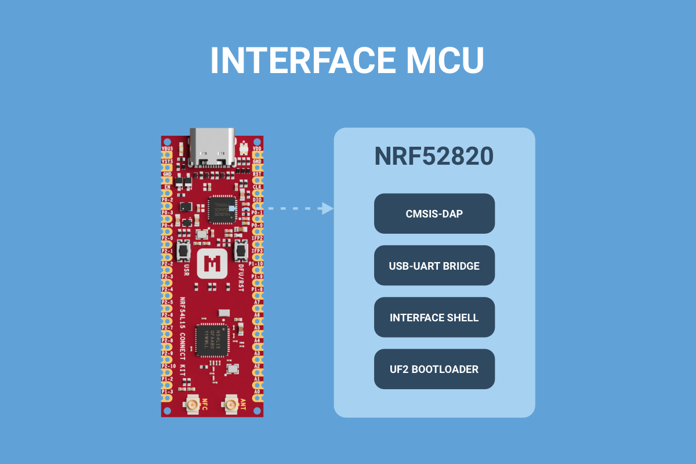
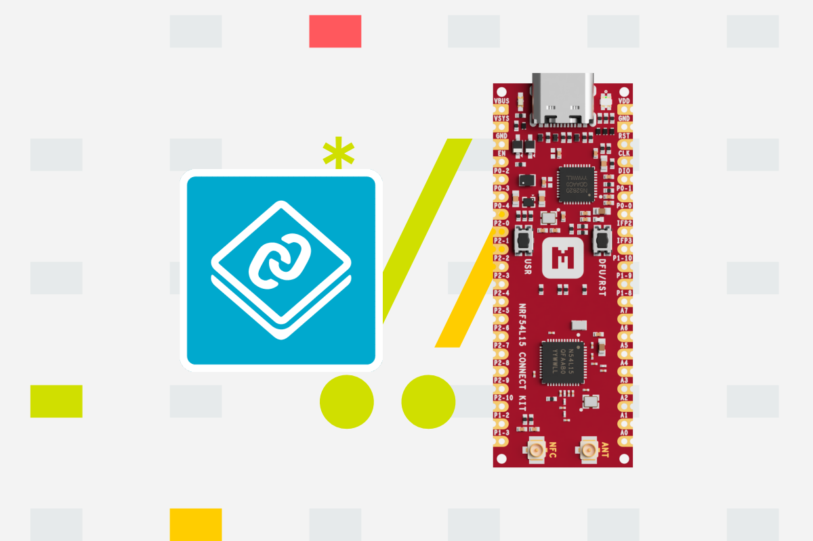

# What's new

-   [][introducing-interface-mcu]

    __[Introducing Interface MCU][introducing-interface-mcu]__

    The Interface MCU enables onboard debugging and programming, eliminating the need for external tools, while enabling access to board-specific features.

    :octicons-calendar-24: Aug 23, 2025 ・ :octicons-clock-24: 3 min read

    [introducing-interface-mcu]: ./blog/posts/introducing-interface-mcu/index.md

-   [][introducing-nrf-connect-sdk]

    __[Introducing nRF Connect SDK][introducing-nrf-connect-sdk]__

    nRF Connect SDK is a scalable and unified software development kit for building low-power wireless applications based on the Nordic Semiconductor wireless devices.

    :octicons-calendar-24: Aug 22, 2025 ・ :octicons-clock-24: 6 min read

    [introducing-nrf-connect-sdk]: ./blog/posts/introducing-nrf-connect-sdk/index.md

-   [][nrf54l15-connect-kit-now-available]

    __[nRF54L15 Connect Kit Now Available][nrf54l15-connect-kit-now-available]__

    Today, we’re thrilled to launch the nRF54L15 Connect Kit, enabling developers to harness the advanced capabilities of Nordic’s nRF54L15 SoC for cutting-edge IoT designs.

    :octicons-calendar-24: Aug 21, 2025 ・ :octicons-clock-24: 5 min read

    [nrf54l15-connect-kit-now-available]: ./blog/posts/nrf54l15-connect-kit-now-available/index.md

[View all](./blog/index.md){ .md-button .md-button--primary }

