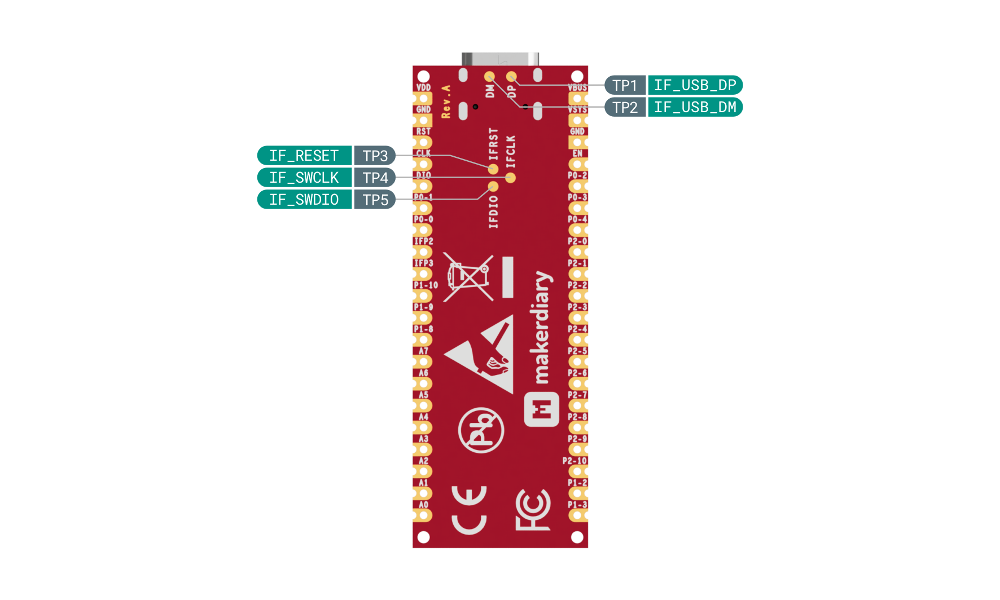

# nRF54L15 Connect Kit <small>Rapid Prototyping Kit for Your Next-Gen IoT Devices powered by the nRF54L15 Multiprotocol SoC</small>

## Introduction

nRF54L15 Connect Kit is a rapid prototyping kit built around the [nRF54L15] multiprotocol
SoC featuring a 128 MHz Arm Cortex®-M33 processor and a 128 MHz RISC-V coprocessor with
1.5 MB NVM and 256 KB RAM. It supports Bluetooth Low Energy 6.0, Thread®, Matter, Zigbee®,
4 Mbps proprietary 2.4 GHz mode, NFC and enhanced security.

The design integrates an [nRF52820]-based Interface MCU that enables onboard debugging and
programming, eliminating the need for external tools. The Interface MCU also includes a
USB-UART bridge for log, trace and terminal emulation, and an Interface Shell bundled with
helpful commands to access the board-specific functionality.

The board contains a [TPS63901] buck-boost converter with 75-nA quiescent current and 1.8V/3.3V
configurable power supply for I/Os, supporting various options for easily powering the unit
from USB-C, external supplies or batteries.

It also has USB-C, LEDs, Buttons, U.FL receptacles for U.FL cabled 2.4 GHz Antenna and 13.56
MHz NFC Antenna, Arm Serial Wire Debug (SWD) port and dual-row 40 pins with loose or pre-soldered
headers available.

[nRF Connect SDK] is supported, including the [Zephyr RTOS]. Developers can explore the full
potential of the nRF54L15 using the extensive range of software samples, modules, and libraries
available within the nRF Connect SDK. It is open source, and can be leveraged and modified to
suit your specific needs.

## Key Features

* Nordic Semiconductor nRF54L15 SoC

	- 128 MHz Arm Cortex®-M33 processor and 128 MHz RISC-V coprocessor
	- 1.5 MB NVM and 256 KB RAM
	- Multiprotocol 2.4 GHz radio supporting Bluetooth Low Energy, 802.15.4-2020, and 2.4 GHz
	  proprietary modes (up to 4 Mbps)
	- Advanced security features with physical protection
	- Global RTC (GRTC) available in System OFF mode
	- 5x SPI/UART/I2C, 3x PWM, 2x QDEC, I2S, PDM, 14-bit ADC, GPIOs
	- Integrated NFC-A Tag

* On-board Interface MCU

	- Built using nRF52820 with 64 MHz Arm Cortex-M4, 256 KB Flash & 32 KB RAM
	- Built-in CMSIS-DAP support for debugging and programming
	- USB-UART bridge for log, trace and terminal emulation
	- Interface Shell with helpful commands to access the board-specific functionality
	- Self-upgradable UF2 Bootloader featuring drag-and-drop programming for Interface MCU firmware update
	- Open source and more features will be released gradually over time

* TPS63901 buck-boost converter with 75-nA quiescent current and 1.8V/3.3V configurable power supply for I/Os
* Shipped with U.FL cabled 2.4 GHz Antenna and 13.56 MHz NFC Antenna
* Up to 31 multi-function GPIOs (8 can be configured as ADC inputs) through edge pins
* Arm Serial Wire Debug (SWD) port through edge pins
* USB-C, LEDs, Buttons and U.FL receptacles
* Dual-row 40 pins in 55.88mm x 20.32mm (2.2" x 0.8") DIP/SMT form factor
* Available in Loose or Pre-soldered headers options
* Built on open source, supporting nRF Connect SDK and Zephyr RTOS, etc

## Hardware Diagram

[][HW Diagram PDF]

[][HW Diagram PDF]

## What's in the box

|Part                                                       |Quantity |
|-----------------------------------------------------------|---------|
|nRF54L15 Connect Kit Board (Loose or Pre-soldered Headers) |1        |
|U.FL cabled 2.4 GHz Antenna                                |1        |
|U.FL cabled 13.56 MHz NFC Antenna                          |1        |

[nRF54L15]: https://www.nordicsemi.com/Products/nRF54L15
[nRF52820]: https://www.nordicsemi.com/Products/nrf52820
[BQ25180]: https://www.ti.com/product/BQ25180
[TPS63901]: https://www.ti.com/product/TPS63901
[nRF Connect SDK]: https://github.com/nrfconnect/sdk-nrf
[Zephyr RTOS]: https://github.com/zephyrproject-rtos/zephyr
[HW Diagram PDF]: ./assets/attachments/nrf54ll15-connect-kit-pinout-diagram_reva.pdf
